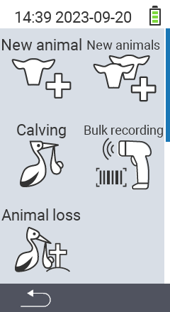

Päävalikon kohdan  `Uusi` kautta pääset alavalikkoon, jossa on esitetty 5 alakohtaa valittavaksi:

<map name="workmap">
  <area shape="rect" coords="3,40,116,160" alt="Uusi eläin" title="Kuinka rekisteröidä uusi eläin käyttäen VitalControl-laitetta&#10;Hiiren klikkaus: avaa dokumentaatio" href="/fi/docs/new/animal/">
  <area shape="rect" coords="3,160,116,280" alt="Vasikointi" title="Kuinka rekisteröidä uusi vasikointi käyttäen VitalControl-laitetta&#10;Hiiren klikkaus: avaa dokumentaatio" href="/fi/docs/new/calving/">
  <area shape="rect" coords="3,280,116,399" alt="Eläimen menetys" title="Kuinka rekisteröidä eläimen menetys käyttäen VitalControl-laitetta&#10;Hiiren klikkaus: avaa dokumentaatio" href="/fi/docs/new/animal-loss/">

  <area shape="rect" coords="116,40,230,160" alt="Uudet eläimet" title="Kuinka luoda useita uusia eläimiä VitalControl-laitteella yhdellä toimenpiteellä&#10;Hiiren klikkaus: avaa dokumentaatio" href="/fi/docs/new/animals/">
  <area shape="rect" coords="116,160,230,280" alt="Erärekisteröinti" title="Käytä viivakoodinlukijaa rekisteröidäksesi useita eläimiä&#10;Hiiren klikkaus: avaa dokumentaatio" href="/fi/docs/new/bulk-recording/">

  <area shape="rect" coords="1,401,100,439" alt="Takaisin" title="Hyppää takaisin yksi taso&#10;Hiiren klikkaus: dokumentaatioon" href="/fi/docs/menu/mainmenu/">
</map>

{}
Jokaisella alavalikolla on oma ikoninsa. Siirrä hiiren osoitin yhden yläpuolella olevan kuvakkeen päälle ja anna sen olla hetken aikaa. Työkaluvihje ilmestyy, näyttäen tietoa valitusta alavalikosta. Jos klikkaat jotakin ikoneista, sinut ohjataan valitun alavalikon kohdan kuvaussivulle.
{}
