
<a class="btn btn-lg btn-primary me-3 mb-4" href="#td-block-2">
  En savoir plus <i class="fas fa-arrow-alt-circle-right ms-2"></i>
</a>
<a class="btn btn-lg btn-secondary me-3 mb-4" href="/fr/docs/">
  Documentation<i class="fa-solid fa-book ms-2 "></i>
</a>

Gestion de la santé au plus haut niveau !




{}

**Réduisez** la **paperasserie**  

**Améliorez** la **santé de vos animaux**

Ayez **tout** sous les **yeux**   

Avec un seul **appareil**     
{}


{}
 

    

    <button type="button" data-bs-target="#carouselLanguageIndicators" data-bs-slide-to="0" class="active" aria-current="true" aria-label="Allemand"></button>
    <button type="button" data-bs-target="#carouselLanguageIndicators" data-bs-slide-to="1" aria-label="Anglais"></button>
    <button type="button" data-bs-target="#carouselLanguageIndicators" data-bs-slide-to="2" aria-label="Néerlandais"></button>
    <button type="button" data-bs-target="#carouselLanguageIndicators" data-bs-slide-to="3" aria-label="Finnois"></button>
    <button type="button" data-bs-target="#carouselLanguageIndicators" data-bs-slide-to="4" aria-label="Français"></button>
    <button type="button" data-bs-target="#carouselLanguageIndicators" data-bs-slide-to="5" aria-label="Russe"></button>
    <button type="button" data-bs-target="#carouselLanguageIndicators" data-bs-slide-to="6" aria-label="Espagnol"></button>
    <button type="button" data-bs-target="#carouselLanguageIndicators" data-bs-slide-to="7" aria-label="Bosniaque"></button>
    <button type="button" data-bs-target="#carouselLanguageIndicators" data-bs-slide-to="8" aria-label="Bulgare"></button>
    <button type="button" data-bs-target="#carouselLanguageIndicators" data-bs-slide-to="9" aria-label="Chinois"></button>
    <button type="button" data-bs-target="#carouselLanguageIndicators" data-bs-slide-to="10" aria-label="Tchèque"></button>
    <button type="button" data-bs-target="#carouselLanguageIndicators" data-bs-slide-to="11" aria-label="Norvégien"></button>
    <button type="button" data-bs-target="#carouselLanguageIndicators" data-bs-slide-to="12" aria-label="Grec"></button>
    <button type="button" data-bs-target="#carouselLanguageIndicators" data-bs-slide-to="13" aria-label="Turc"></button>
    <button type="button" data-bs-target="#carouselLanguageIndicators" data-bs-slide-to="14" aria-label="Ukrainien"></button>
    <button type="button" data-bs-target="#carouselLanguageIndicators" data-bs-slide-to="15" aria-label="Estonien"></button>
    
 

    

      

        <h3>Allemand</h3>
      

      
    

    

      

        <h3>Néerlandais</h3>
      

      
    

    

      

        <h3>Anglais</h3>
      

      
    

    

      

        <h3>Finnois</h3>
      

      
    

    

      

        <h3>Français</h3>
      

      
    

    

      

        <h3>Russe</h3>
      

    
    
  
    

      

        <h3>Espagnol</h3>
      

    
    

      

        

          <h3>Bosniaque</h3>
        

      
      

      

        

          <h3>Bulgare</h3>
        

      
      

      

        

          <h3>Chinois</h3>
        

      
      

      

        

          <h3>Tchèque</h3>
        

      
      

      

        

          <h3>Norvégien</h3>
        

      
      

      

        

          <h3>Grec</h3>
        

      
      
      
      

        

          <h3>Turc</h3>
        

      
      
 
      

        

          <h3>Ukrainien</h3>
        

      
      
 
      

        

          <h3>Estonien</h3>
        

      
      
 
  

  <button class="carousel-control-prev" type="button" data-bs-target="#carouselLanguagesAutoplaying" data-bs-slide="prev" style="left: 0px; top: 37px; height: 320px;">
    
    Précédent
  </button>
  <button class="carousel-control-next" type="button" data-bs-target="#carouselLanguagesAutoplaying" data-bs-slide="next" style="right: 0px; top: 37px; height: 320px;">
    
    Suivant
  </button>

{}

{}
 

    

    <button type="button" data-bs-target="#carouselActionsIndicators" data-bs-slide-to="0" class="active" aria-current="true" aria-label="Température"></button>
    <button type="button" data-bs-target="#carouselActionsIndicators" data-bs-slide-to="1" aria-label="Pesage"></button>
    <button type="button" data-bs-target="#carouselActionsIndicators" data-bs-slide-to="2" aria-label="Évaluation"></button>
    <button type="button" data-bs-target="#carouselActionsIndicators" data-bs-slide-to="3" aria-label="Chaîne d'actions"></button>
    <button type="button" data-bs-target="#carouselActionsIndicators" data-bs-slide-to="4" aria-label="Alarme"></button>
    <button type="button" data-bs-target="#carouselActionsIndicators" data-bs-slide-to="5" aria-label="Surveillance"></button>
    <button type="button" data-bs-target="#carouselActionsIndicators" data-bs-slide-to="6" aria-label="Historique de l'animal"></button>
    <button type="button" data-bs-target="#carouselActionsIndicators" data-bs-slide-to="7" aria-label="Modifier"></button>
    <button type="button" data-bs-target="#carouselActionsIndicators" data-bs-slide-to="8" aria-label="Désinscrire"></button>
    <button type="button" data-bs-target="#carouselActionsIndicators" data-bs-slide-to="9" aria-label="Perte de l'animal"></button>
    <button type="button" data-bs-target="#carouselActionsIndicators" data-bs-slide-to="10" aria-label="Lier le transpondeur"></button>
    <button type="button" data-bs-target="#carouselActionsIndicators" data-bs-slide-to="11" aria-label="Détacher le transpondeur"></button>
    <button type="button" data-bs-target="#carouselActionsIndicators" data-bs-slide-to="12" aria-label="Lier l'ID de l'animal"></button>
    <button type="button" data-bs-target="#carouselActionsIndicators" data-bs-slide-to="13" aria-label="Lier l'ID électronique de l'animal"></button>
  

    

      

        <h3>Température</h3>
      

      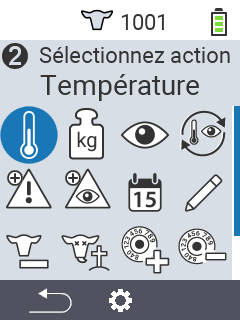
    

    

      

        <h3>Pesage</h3>
      

      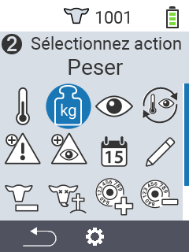
    

    

      

        <h3>Évaluation</h3>
      

      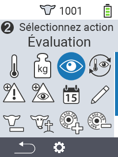
    

    

      

        <h3>Chaîne d'actions</h3>
      

      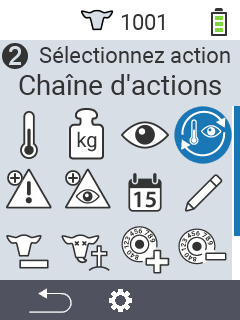
    

    

      

        <h3>Alarme</h3>
      

      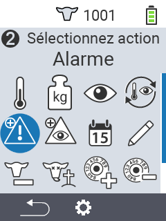
    

    

      

        <h3>Surveillance</h3>
      

      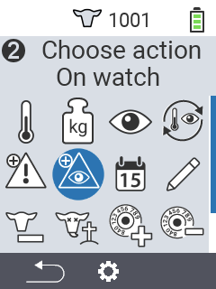
    

    

      

        <h3>Historique de l'animal</h3>
      

      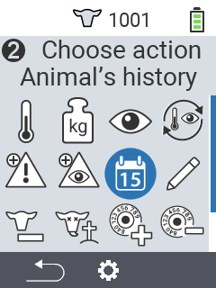
    

    

      

        <h3>Modifier</h3>
      

      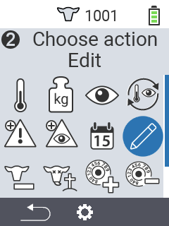
    

    

      

        <h3>Désinscrire</h3>
      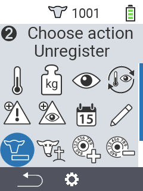
      

    

    

      

        <h3>Perte de l'animal</h3>
      

      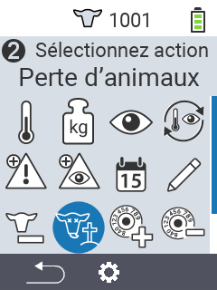
    

    

      

        <h3>Lier le transpondeur</h3>
      

      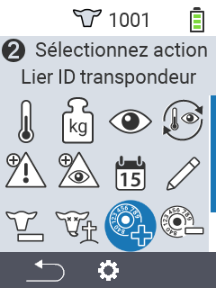
    

    

      

        <h3>Détacher le transpondeur</h3>
      

      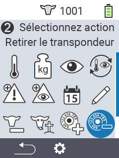
    
      
    

      

        <h3>Lier l'ID de l'animal</h3>
      

      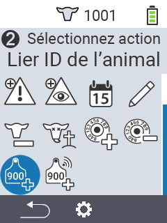
    
   
    

      

        <h3>Lier l'ID de l'animal</h3>
      

      
    
             
  

  <button class="carousel-control-prev" type="button" data-bs-target="#carouselActionsAutoplaying" data-bs-slide="prev" style="left: 0px; top: 37px; height: 320px;">
    
    Précédent
  </button>
  <button class="carousel-control-next" type="button" data-bs-target="#carouselActionsAutoplaying" data-bs-slide="next" style="right: 0px; top: 37px; height: 320px;">
    
    Suivant
  </button>

{}

{}
 

    

    <button type="button" data-bs-target="#carouselListsIndicators" data-bs-slide-to="0" class="active" aria-current="true" aria-label="Alarme"></button>
    <button type="button" data-bs-target="#carouselListsIndicators" data-bs-slide-to="1" aria-label="En surveillance"></button>
    <button type="button" data-bs-target="#carouselListsIndicators" data-bs-slide-to="2" aria-label="Action"></button>
    <button type="button" data-bs-target="#carouselListsIndicators" data-bs-slide-to="3" aria-label="Vaches fraîches"></button>
    <button type="button" data-bs-target="#carouselListsIndicators" data-bs-slide-to="4" aria-label="Vaches taries"></button>
  

    

      

        <h3>Alarme</h3>
      

      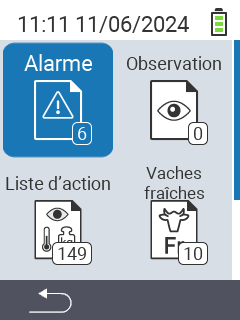
    

    

      

        <h3>En surveillance</h3>
      

      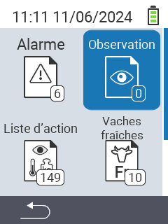
    

    

      

        <h3>Liste d'actions</h3>
      
      
      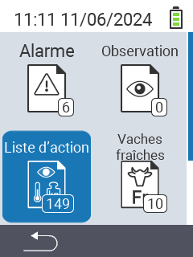
    

    

      

        <h3>Vaches fraîches</h3>
      

      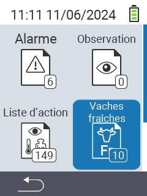
    

    

      

        <h3>Vaches taries</h3>
      

    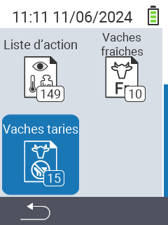
    

  

  <button class="carousel-control-prev" type="button" data-bs-target="#carouselListsAutoplaying" data-bs-slide="prev" style="left: 0px; top: 37px; height: 320px;">
    
    Précédent
  </button>
  <button class="carousel-control-next" type="button" data-bs-target="#carouselListsAutoplaying" data-bs-slide="next" style="right: 0px; top: 37px; height: 320px;">
    
    Suivant
  </button>

{}

{}
 

    

    <button type="button" data-bs-target="#carouselListsIndicators" data-bs-slide-to="0" class="active" aria-current="true" aria-label="Poids de l'évaluation"></button>
    <button type="button" data-bs-target="#carouselListsIndicators" data-bs-slide-to="1" aria-label="Température de l'évaluation"></button>
    <button type="button" data-bs-target="#carouselListsIndicators" data-bs-slide-to="2" aria-label="Note de l'évaluation"></button>
    <button type="button" data-bs-target="#carouselListsIndicators" data-bs-slide-to="3" aria-label="Mortalité de l'évaluation"></button>
  

    

      

        <h3>Poids</h3>
      
 
      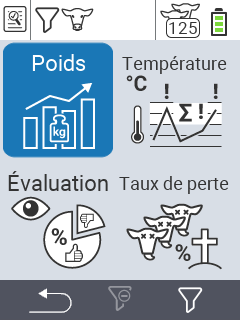
    

    

      

        <h3>Température</h3>
      
 
      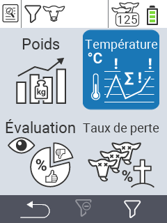
    

    

      

        <h3>Note</h3>
      
 
      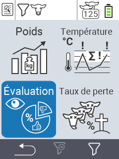
    

    

      

        <h3>Mortalité</h3>
      
 
      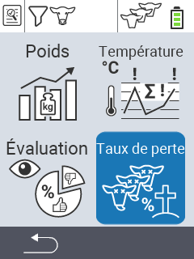
    

  

  <button class="carousel-control-prev" type="button" data-bs-target="#carouselEvaluationAutoplaying" data-bs-slide="prev" style="left: 0px; top: 37px; height: 320px;">
    
    Précédent
  </button>
  <button class="carousel-control-next" type="button" data-bs-target="#carouselEvaluationAutoplaying" data-bs-slide="next" style="right: 0px; top: 37px; height: 320px;">
    
    Suivant
  </button>

{}


{}

Convient à plusieurs **types d'animaux** à différents **âges**

{}


{}
 

 
{}

{}
 

 
{}

{}
 

 
{}



{}

Nos **points forts** pour vous

{}


{}
 
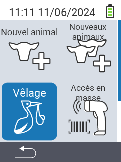
 
{}

{}
 
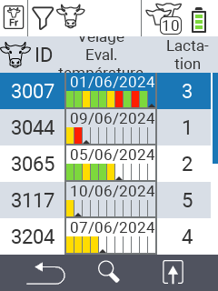
 
{}

{}
 

 
{}

{}
 

 
{}



{}
Urban sur les réseaux sociaux

{}

{}

{}
{}

{}
{}

{}
{}

{}
{}


