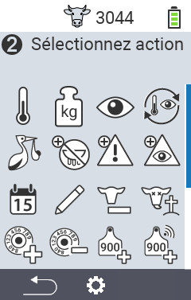
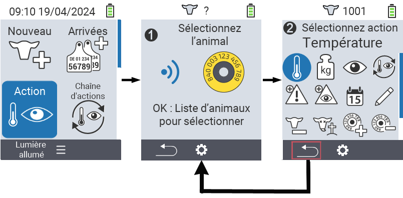
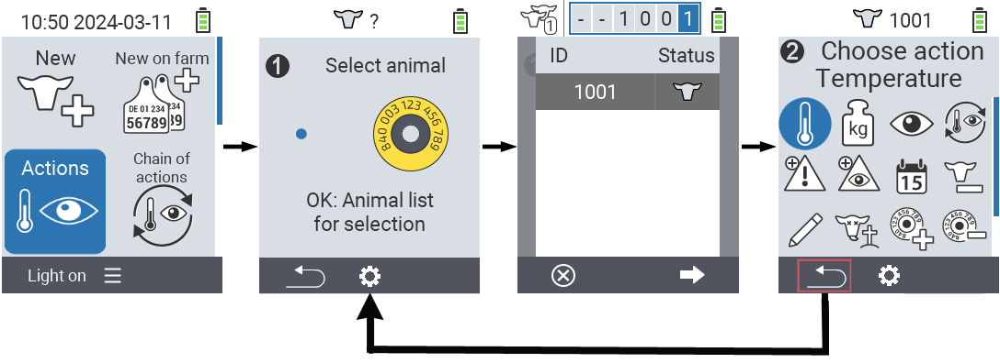

## Actions disponibles

Selon le type d'animal, vous pouvez effectuer jusqu'à 16 actions différentes pour un animal.

<map name="workmap">
  <area shape="rect" coords="3,100,60,165" alt="Température" title="Mesurer la fièvre chez vos animaux&#10;Clic de souris : ouvrir la documentation" href="/fr/docs/actions/measure-temperature/">
  <area shape="rect" coords="60,100,118,165" alt="Peser" title="Enregistrer le poids de vos animaux&#10;Clic de souris : ouvrir la documentation" href="/fr/docs/actions/record-weight/">
  <area shape="rect" coords="118,100,174,165" alt="Évaluation" title="Évaluer vos animaux&#10;Clic de souris : ouvrir la documentation" href="/fr/docs/actions/rating/">
  <area shape="rect" coords="174,100,230,165" alt="Chaîne d'actions" title="Appliquer et configurer la chaîne d'actions&#10;Clic de souris : ouvrir la documentation" href="/fr/docs/chain-of-actions/">
   <area shape="rect" coords="3,165,60,225" alt="Vêlage" title="Enregistrer un vêlage&#10;Clic de souris : ouvrir la documentation" href="/fr/docs/actions/calving/">
   <area shape="rect" coords="60,165,120,225" alt="Tarissement" title="Tarir une vache ou l'ajouter à la liste des vaches fraîches&#10;Clic de souris : ouvrir la documentation" href="/fr/docs/actions/dry-off/">
   <area shape="rect" coords="120,165,175,225" alt="Alarme" title="Ajouter des animaux à la liste d'alarme ou les en retirer&#10;Clic de souris : ouvrir la documentation" href="/fr/docs/actions/alarm/">
   <area shape="rect" coords="175,165,230,225" alt="En surveillance" title="Mettre des animaux sur la liste de surveillance ou les en retirer&#10;Clic de souris : ouvrir la documentation" href="/fr/docs/actions/on-watch/">
   <area shape="rect" coords="3,225,60,280" alt="Historique de l'animal" title="Consulter l'historique d'un animal&#10;Clic de souris : ouvrir la documentation" href="/fr/docs/actions/animal-history/">
   <area shape="rect" coords="60,225,120,280" alt="Modifier" title="Modifier les données de l'animal sélectionné&#10;Clic de souris : ouvrir la documentation" href="/fr/docs/actions/edit/">
   <area shape="rect" coords="120,225,175,280" alt="Désinscription" title="Désinscrire un animal&#10;Clic de souris : ouvrir la documentation" href="/fr/docs/actions/unregister/">
   <area shape="rect" coords="175,225,230,280" alt="Perte d'animal" title="Enregistrer une perte d'animal&#10;Clic de souris : ouvrir la documentation" href="/fr/docs/actions/animal-loss/">
   <area shape="rect" coords="3,280,60,337" alt="Associer un transpondeur" title="Attribuer un transpondeur à un animal&#10;Clic de souris : ouvrir la documentation" href="/fr/docs/actions/link-transponder/">
   <area shape="rect" coords="55,280,120,337" alt="Dissocier un transpondeur" title="Retirer l'association de transpondeur d'un animal&#10;Clic de souris : ouvrir la documentation" href="/fr/docs/actions/unlink-transponder/">
   <area shape="rect" coords="120,280,175,337" alt="Associer manuellement un ID animal" title="Attribuer un ID national à un animal qui n'a pas d'ID national&#10;Clic de souris : ouvrir la documentation" href="/fr/docs/actions/link-animal-id/#link-animal-id">
   <area shape="rect" coords="175,280,230,337" alt="Associer un ID animal avec scan" title="Attribuer un ID national à un animal qui n'a pas d'ID national&#10;Clic de souris : ouvrir la documentation" href="/fr/docs/actions/link-animal-id/#link-animal-id-with-electronic-ear-tag-scan">

<area shape="rect" coords="100,340,140,375" alt="Paramètres" title="Accéder aux paramètres&#10;Clic de souris : vers la documentation" href="/fr/docs/actions/setting/">
</map>

{}
Chaque action est identifiée par un symbole. Passez le curseur de la souris sur un symbole dans le graphique ci-dessous et laissez-le reposer un moment. Une infobulle apparaîtra fournissant des informations sur l'action concernée. Si vous cliquez sur l'un des symboles, vous serez redirigé vers une description de l'action spécifique.
{}

## Procédure générale

Dans le menu  `Action`, vous pouvez à tout moment sélectionner l'animal suivant sans avoir à quitter l'élément de menu Actions. Suivez ces étapes pour sélectionner l'animal suivant :

1. Sélectionnez l'élément de menu  `Action` sur l'écran principal de votre appareil VitalControl et appuyez sur le bouton `OK`.

2. Scannez un animal avec le transpondeur ou sélectionnez un animal dans la liste. Confirmez en appuyant sur `OK` et sélectionnez un animal avec les touches fléchées △ ▽. Confirmez avec `OK`.

3. Un sous-menu s'ouvre où vous trouverez des icônes pour de nombreuses actions animales. Utilisez les touches fléchées pour sélectionner l'action désirée et lancez l'action en appuyant sur le bouton `OK`. Selon l'action sélectionnée, un ou plusieurs écrans ou une fenêtre pop-up apparaîtront.

4. Si vous le souhaitez, vous pouvez maintenant sélectionner et exécuter une autre action pour l'animal actuel.

5. Après avoir exécuté l'action(s) désirée(s) pour l'animal, revenez à l'étape 2 'Sélection de l'animal'. Faites cela en appuyant sur le bouton gauche `F1` sous le symbole `Retour` dans le coin inférieur gauche du pied de page.

6. La fenêtre de l'étape deux s'ouvre automatiquement à nouveau et vous pouvez sélectionner l'animal suivant ou retourner au menu principal en appuyant sur le bouton `F1` sous le symbole `Retour`.



{}

{}
{}

{}

