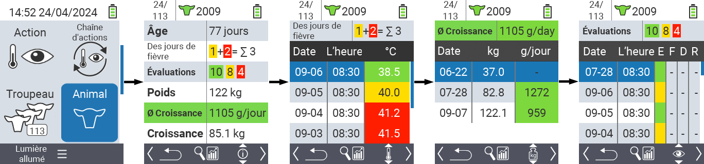
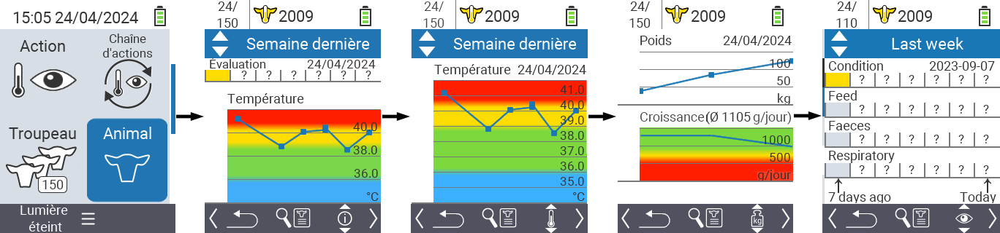
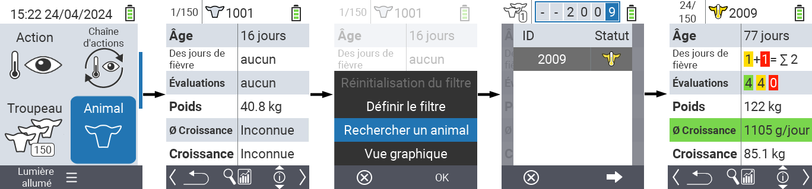
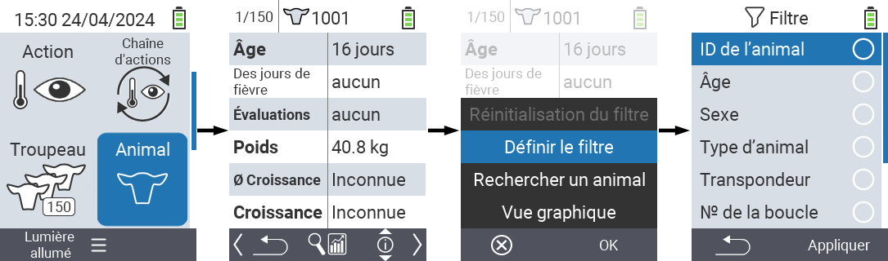

## Animal {#animal}

La fonction animal individuel vous permet de consulter des informations importantes concernant le poids, la température et l'évaluation pour chaque animal individuellement. Vous avez toujours la possibilité d'afficher les informations sous forme graphique ou sous forme de liste. Pour utiliser la fonction animal individuel, procédez comme suit :

1. Sur l'écran principal de votre appareil VitalControl, sélectionnez l'élément de menu  `` et appuyez sur le bouton ``.

2. Un aperçu des informations les plus importantes sur l'animal s'ouvre. Le bord supérieur de l'écran vous indique quel animal vous consultez actuellement. Utilisez la touche `F3` pour choisir entre les informations sur l'animal , la température , le poids   et l'évaluation .

{}
Dans chaque affichage d'information, vous avez la possibilité de [rechercher un animal](#search-animal), de définir un [filtre](#set-filter) et de passer à une [vue graphique](#set-graphical-view).
Vous pouvez également passer d'un animal à l'autre à tout moment en utilisant les touches fléchées ◁ ▷.
{}

### Définir la vue graphique {#set-graphical-view}

1. Appuyez sur le bouton supérieur central `On/Off`  afin d'ouvrir un menu pop-up. Dans ce menu, vous pouvez choisir entre les fonctions ``, ``, ou ``.

2. Sélectionnez `` avec les touches fléchées △ ▽ et confirmez avec ``.

### Rechercher un animal {#search-animal}

1. Appuyez sur le bouton supérieur central `On/Off`  afin d'ouvrir un menu pop-up. Dans ce menu, vous pouvez choisir entre les fonctions ``, `` ou ``.

2. Sélectionnez `` avec les touches fléchées △ ▽ et confirmez avec ``.

3. Utilisez les touches fléchées △ ▽ ◁ ▷ pour sélectionner le numéro de l'animal désiré et confirmez avec ``.

### Définir le filtre {#set-filter}

1. Appuyez sur le bouton supérieur central `On/Off`  afin d'ouvrir un menu pop-up. Dans ce menu, vous pouvez choisir entre les fonctions ``, `` ou ``.

2. Sélectionnez `` avec les touches fléchées △ ▽ et confirmez avec ``.
Vous pouvez obtenir des instructions sur comment utiliser le filtre [ici]().

