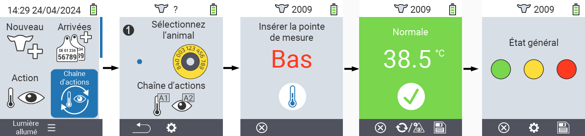
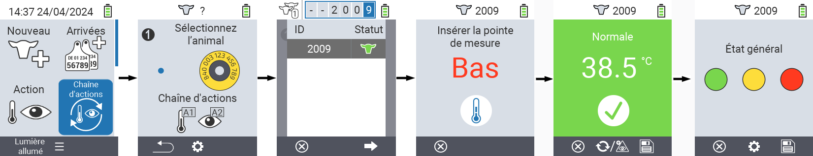
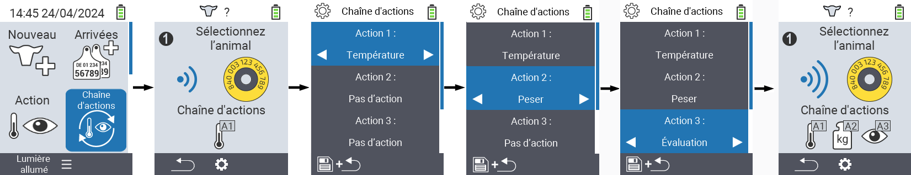

## Chaîne d'actions {#chain-of-actions}

La chaîne d'actions vous permet d'exécuter automatiquement plusieurs actions pour un animal l'une après l'autre. Par exemple, vous pouvez sélectionner les actions `` et ``. Si vous exécutez ensuite la chaîne d'actions, vous pouvez d'abord prendre la température de votre animal et enregistrer l'évaluation immédiatement après.

### Utiliser la chaîne d'actions {#use-chain-of-actions}

1. Sur l'écran principal de votre appareil VitalControl, sélectionnez l'élément de menu &nbsp;&nbsp; `` et appuyez sur le bouton ``.

2. Soit scannez un animal à l'aide du transpondeur, soit confirmez avec `` et utilisez les touches fléchées △ ▽ ◁ ▷ pour entrer l'ID de l'animal souhaité.

3. La chaîne d'actions est maintenant exécutée. Dès que toutes les actions dans la chaîne d'actions ont été effectuées, le prochain animal peut être sélectionné directement.



{}

{}
{}

{}


### Configurer la chaîne d'actions {#set-chain-of-actions}

1. Sur l'écran principal de votre appareil VitalControl, sélectionnez l'élément de menu &nbsp;&nbsp; `` et appuyez sur le bouton ``.

2. Utilisez le bouton `F2` &nbsp;&nbsp; (``).

3. Un écran superposé apparaît. Utilisez les touches fléchées △ ▽ pour choisir entre les actions listées 1 - 4 (vous pouvez effectuer jusqu'à quatre actions de suite). Utilisez les touches fléchées ◁ ▷ pour sélectionner l'action désirée pour l'action respective. Sauvegardez les paramètres avec la touche `F1` &nbsp;&nbsp;.

4. Si vous souhaitez réinitialiser la chaîne d'actions complète, sélectionnez l'option `` dans le sous-menu en utilisant les touches fléchées △ ▽ et confirmez avec ``.

    

{}
Dans les actions individuelles, vous disposez des mêmes options de réglage que celles décrites dans le chapitre [Actions](../actions) pour chaque action individuelle.
{}

{}
Les symboles dans l'écran de démarrage de la chaîne d'actions montrent quelles actions vous avez définies et dans quel ordre.
{}
