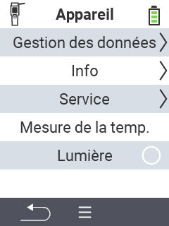

{}
Si vous cliquez sur un élément de menu, vous serez redirigé vers une description de la fonction respective.
{}

<map name="workmap">
  <area shape="rect" coords="2,40,238,80" alt="Gestion des données" title="Exécutez des sauvegardes de données, exportez vos données et réinitialisez l'appareil&#10;Clic de souris : ouvrir la documentation" href="/fr/docs/device/data-management/">
  <area shape="rect" coords="2,80,238,120" alt="Info" title="Voir les informations importantes sur le logiciel et le matériel&#10;Clic de souris : ouvrir la documentation" href="/fr/docs/device/info/">
  <area shape="rect" coords="2,120,238,160" alt="Service" title="Vérifiez vos pilotes d'appareil, mettez à jour votre firmware et effectuez un test de portée&#10;Clic de souris : ouvrir la documentation" href="/fr/docs/device/service/">
  <area shape="rect" coords="2,160,238,200" alt="Mesure de température" title="Testez la mesure de température de votre appareil&#10;Clic de souris : ouvrir la documentation" href="/fr/docs/device/temperature-measurement/">
  <area shape="rect" coords="2,200,238,240" alt="Lampe de poche" title="Allumez ou éteignez la lumière de votre appareil VitalControl&#10;Clic de souris : ouvrir la documentation" href="/fr/docs/device/flashlight/">

  <area shape="rect" coords="2,282,97,318" alt="Retour" title="Revenir d'un niveau" href="/fr/docs/menu/mainmenu/">
</map>
