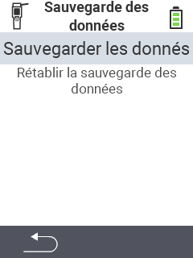

<map name="workmap">
  <area shape="rect" coords="2,40,238,80" alt="Créer une sauvegarde" title="Les instructions pour créer une sauvegarde se trouvent ici&#10;Clic de souris : ouvrir la documentation" href="/fr/docs/backup/backup/">

  <area shape="rect" coords="2,80,238,120" alt="Restaurer une sauvegarde" title="Les instructions pour restaurer une sauvegarde se trouvent ici&#10;Clic de souris : ouvrir la documentation" href="/fr/docs/backup/restore/">

  <area shape="rect" coords="2,282,120,319" alt="Retour" title="Revenir d'un niveau&#10;Clic de souris : ouvrir la documentation" href="/fr/docs/device/data-management/">
</map>
