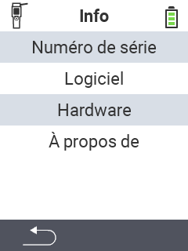

{}
Si vous cliquez sur un élément de menu, vous serez redirigé vers une description de la fonction respective.
{}

<map name="workmap">
  <area shape="rect" coords="2,40,238,80" alt="Numéro de série" title="Pour récupérer le numéro de série de votre appareil, cliquez ici&#10;Clic de souris : pour la documentation" href="/fr/docs/device/info/serial-number/">
  <area shape="rect" coords="2,80,238,120" alt="Logiciel" title="Les instructions pour consulter votre version de logiciel se trouvent ici&#10;Clic de souris : pour la documentation" href="/fr/docs/firmware/versions/">
  <area shape="rect" coords="2,120,238,160" alt="Matériel" title="Pour accéder aux informations matérielles de votre appareil, cliquez ici&#10;Clic de souris : pour la documentation" href="/fr/docs/device/info/hardware/">
  <area shape="rect" coords="2,160,238,200" alt="À propos" title="Consulter les informations du fournisseur&#10;Clic de souris : pour la documentation" href="/fr/docs/device/info/about/">

  <area shape="rect" coords="2,282,120,319" alt="Retour" title="Revenir au niveau précédent&#10;Clic de souris : ouvrir la documentation" href="/fr/docs/device/">
</map>
