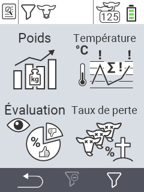

{}
Si vous cliquez sur un élément de menu, vous serez redirigé vers une description de la fonction respective.
{}

<map name="workmap">
  <area shape="rect" coords="3,40,116,160" alt="Poids" title="Évaluez vos données stockées dans la section Poids&#10;Clic de souris : ouvrir la documentation" href="/fr/docs/evaluation/weight/">
  <area shape="rect" coords="3,160,116,279" alt="Évaluation" title="Évaluez vos données stockées dans la section évaluation&#10;Clic de souris : ouvrir la documentation" href="/fr/docs/evaluation/rating/">

  <area shape="rect" coords="116,40,238,160" alt="Température" title="Évaluez vos données stockées dans la section Température&#10;Clic de souris : ouvrir la documentation" href="/fr/docs/evaluation/temperature/">
  <area shape="rect" coords="116,160,238,279" alt="Mortalité" title="Évaluez vos données stockées dans la section mortalité&#10;Clic de souris : ouvrir la documentation" href="/fr/docs/evaluation/mortality/">

  <area shape="rect" coords="150,282,238,319" alt="Filtre" title="Définir un filtre&#10;Clic de souris : vers la documentation" href="/fr/docs/filter">
  <area shape="rect" coords="2,282,95,319" alt="Retour" title="Revenir d'un niveau&#10;Clic de souris : vers la documentation" href="/fr/docs/menu/mainmenu/">
</map>

