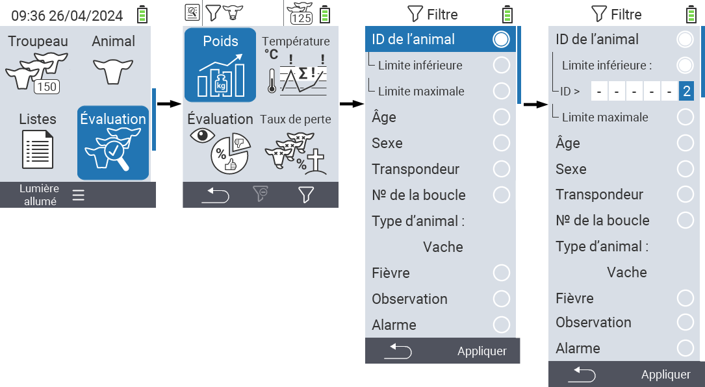

## Application des filtres

{}
Le filtre vous aide à effectuer une sélection en utilisant des critères de filtrage dans les éléments de menu `Troupeau`, `Listes` et `Évaluation` de l'appareil VitalControl. Dès que vous appliquez un filtre, des symboles pour les différents critères de filtrage apparaissent en haut de l'écran. Ces symboles sont utilisés pour vous aider à savoir si et quels critères de filtrage sont activés. Par exemple, si vous réglez le filtre `Sexe` sur masculin, l'appareil n'utilisera que des animaux mâles. Par exemple, si vous activez également le filtre `Sous surveillance`, l'appareil n'utilise que des animaux mâles qui sont sur la liste d'observation.
{}

Pour créer un filtre dans les évaluations, procédez comme suit :

1. Dans le sous-menu appartenant à l'élément de menu principal  `Évaluation` appuyez une fois sur la touche `F3` . Dans le sous-menu appartenant aux éléments de menu principaux  `Listes` et  `Troupeau`, vous devez appuyer deux fois sur la touche.

2. Un sous-menu s'ouvre dans lequel vous pouvez régler toutes les options de filtrage. Vous pouvez filtrer par `ID de l'animal`, `Âge`, `Sexe`, `Transpondeur`, `N° de la boucle`, `Fièvre`, `Observation`, `Type d'animal` et `Alarme`.

3. Pour les filtres `Type d'animal`, `Sexe`, `Transpondeur` et `N° de la boucle` naviguez vers la zone correspondante et confirmez avec `OK`. Utilisez les touches fléchées ◁ ▷ pour spécifier le réglage souhaité. Utilisez la touche `F3` `Appliquer` pour mettre en place le réglage sélectionné. Pour annuler vos modifications de filtre, appuyez sur la touche `F1` &nbsp;&nbsp;.

4. Pour les filtres `ID Animal` et `Âge`, sélectionnez le critère correspondant et confirmez avec `OK`. Vous verrez alors une limite inférieure et supérieure. Naviguez jusqu'à la limite désirée en utilisant les touches fléchées △ ▽ et confirmez en appuyant deux fois sur `OK`. Vous pouvez maintenant régler le nombre désiré en utilisant les touches fléchées ◁ ▷ et les touches fléchées △ ▽. Une fois tous les réglages corrects, appuyez de nouveau sur `OK` pour quitter le mode de réglage et appliquer le(s) filtre(s) sélectionné(s) avec la touche `F3` `Appliquer`. En utilisant la touche `F1` &nbsp;&nbsp;, vous pouvez annuler vos modifications si vous le souhaitez.

5. Pour les filtres `Fièvre`, `Observation` et `Alarme`, il est possible de désactiver ou d'activer leur application. Pour ce faire, sélectionnez le filtre correspondant et confirmez avec `OK`. Le filtre est maintenant actif. Confirmez de nouveau avec `OK` pour désactiver le filtre.

6. Une fois que vous avez réglé tous les filtres, utilisez la touche `F3` `Appliquer` pour mettre en place les filtres définis ou appuyez sur la touche `F1`  pour annuler vos modifications aux filtre(s).
