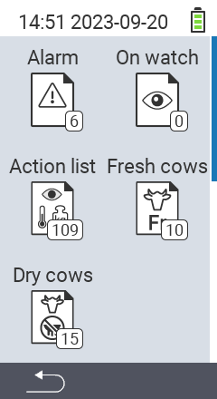

{}
Si vous cliquez sur un élément de menu, vous serez redirigé vers une description de la fonction respective.
{}

<map name="workmap">
  <area shape="rect" coords="3,40,116,160" alt="Liste d'alarmes" title="Consultez votre liste d'alarmes&#10;Clic de souris : ouvrir la documentation" href="/fr/docs/lists/alarm/">
  <area shape="rect" coords="3,160,116,280" alt="Liste d'actions" title="Consultez votre liste d'actions.&#10;Clic de souris : ouvrir la documentation" href="/fr/docs/lists/actions/">
  <area shape="rect" coords="3,280,116,399" alt="Liste des vaches taries" title="Consultez votre liste des vaches taries&#10;Clic de souris : ouvrir la documentation" href="/fr/docs/lists/dry-cows/">

  <area shape="rect" coords="116,40,230,160" alt="Liste de surveillance" title="Consultez votre liste de surveillance&#10;Clic de souris : ouvrir la documentation" href="/fr/docs/lists/on-watch/">
  <area shape="rect" coords="116,160,230,280" alt="Vaches fraîches" title="Consultez votre liste des vaches fraîches&#10;Clic de souris : ouvrir la documentation" href="/fr/docs/lists/fresh-cows/">

  <area shape="rect" coords="2,401,115,438" alt="Retour" title="Revenir d'un niveau" href="/fr/docs/menu/mainmenu/">
</map>

