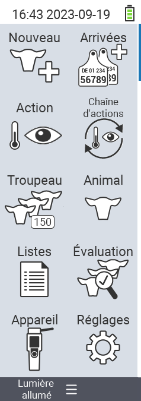

{}
Si vous cliquez sur un élément du menu, vous serez redirigé vers une description de la fonction respective.
{}

<map name="workmap">
  <area shape="rect" coords="3,40,116,160" alt="Nouveau" title="Créer de nouveaux animaux&#10;Clic de souris : ouvrir la documentation" href="/fr/docs/new/">
  <area shape="rect" coords="3,160,116,280" alt="Actions" title="Actions sur les animaux&#10;Clic de souris : ouvrir la documentation" href="/fr/docs/actions/">
  <area shape="rect" coords="3,280,116,400" alt="Troupeau" title="Menu du troupeau&#10;Clic de souris : ouvrir la documentation" href="/fr/docs/herd/">
  <area shape="rect" coords="3,400,116,520" alt="Listes" title="Listes d'animaux&#10;Clic de souris : ouvrir la documentation" href="/fr/docs/lists/">
  <area shape="rect" coords="3,520,116,634" alt="Appareil" title="Appareil&#10;Clic de souris : ouvrir la documentation" href="/fr/docs/device/">

  <area shape="rect" coords="116,40,230,160" alt="Nouveau à la ferme" title="Accès des animaux&#10;Clic de souris : ouvrir la documentation" href="/fr/docs/new-on-farm/">
  <area shape="rect" coords="116,160,230,280" alt="Chaîne d'actions" title="Chaîne d'actions&#10;Clic de souris : ouvrir la documentation" href="/fr/docs/chain-of-actions/">
  <area shape="rect" coords="116,280,230,400" alt="Animal" title="Animal&#10;Clic de souris : ouvrir la documentation" href="/fr/docs/animal/">
  <area shape="rect" coords="116,400,230,520" alt="Évaluation" title="Évaluation&#10;Clic de souris : ouvrir la documentation" href="/fr/docs/evaluation/">
  <area shape="rect" coords="116,520,230,634" alt="Paramètres" title="Paramètres&#10;Clic de souris : ouvrir la documentation" href="/fr/docs/settings/">
</map>

