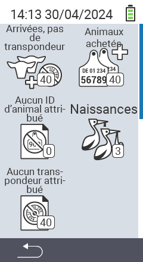

{}
Si vous cliquez sur un élément de menu, vous serez redirigé vers une description de la fonction respective.
{}

<map name="workmap">
  <area shape="rect" coords="3,40,116,160" alt="Nouveau à la ferme, sans transpondeur" title="Ici vous attribuez un transpondeur aux nouveaux animaux sans transpondeur&#10;Clic de souris : ouvrir la documentation" href="/fr/docs/new-on-farm/new-no-transponder/">
  <area shape="rect" coords="3,160,116,280" alt="Aucun identifiant national d'animal attribué" title="Ici vous pouvez voir tous les animaux auxquels aucun identifiant national d'animal n'a encore été attribué et leur attribuer un identifiant national d'animal&#10;Clic de souris : ouvrir la documentation" href="/fr/docs/new-on-farm/no-national-animal-id-assigned/">
  <area shape="rect" coords="3,280,116,399" alt="Aucun transpondeur attribué" title="Ici vous pouvez voir tous les animaux auxquels aucun transpondeur n'a encore été attribué et leur attribuer un transpondeur&#10;Clic de souris : ouvrir la documentation" href="/fr/docs/new-on-farm/no-transponder-assigned/">

  <area shape="rect" coords="116,40,230,160" alt="Animaux achetés" title="Ici vous pouvez voir vos achats actuels et exporter les données&#10;Clic de souris : ouvrir la documentation" href="/fr/docs/new-on-farm/purchased-animals/">
  <area shape="rect" coords="116,160,230,280" alt="Naissances" title="Ici vous pouvez voir vos naissances et créer un fichier d'exportation&#10;Clic de souris : ouvrir la documentation" href="/fr/docs/new-on-farm/births/">
  <area shape="rect" coords="1,401,100,439" alt="Retour" title="Revenir d'un niveau&#10;Clic de souris : à la documentation" href="/fr/docs/menu/mainmenu/">
</map>
