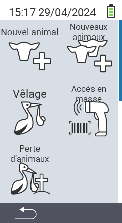

Via l'élément du menu principal  `Nouveau`, vous accédez à un sous-menu, où 5 sous-éléments sont présentés pour sélection :

<map name="workmap">
  <area shape="rect" coords="3,40,116,160" alt="Nouvel animal" title="Comment enregistrer un nouvel animal en utilisant l'appareil VitalControl&#10;Clic de souris : ouvrir la documentation" href="/fr/docs/new/animal/">
  <area shape="rect" coords="3,160,116,280" alt="Vêlage" title="Comment enregistrer un nouveau vêlage en utilisant l'appareil VitalControl&#10;Clic de souris : ouvrir la documentation" href="/fr/docs/new/calving/">
  <area shape="rect" coords="3,280,116,399" alt="Perte d'animal" title="Comment enregistrer la perte d'un animal en utilisant l'appareil VitalControl&#10;Clic de souris : ouvrir la documentation" href="/fr/docs/new/animal-loss/">

  <area shape="rect" coords="116,40,230,160" alt="Nouveaux animaux" title="Comment créer plusieurs nouveaux animaux sur l'appareil VitalControl en une seule action&#10;Clic de souris : ouvrir la documentation" href="/fr/docs/new/animals/">
  <area shape="rect" coords="116,160,230,280" alt="Enregistrement en masse" title="Utilisez le scanner de codes-barres pour enregistrer une variété d'animaux&#10;Clic de souris : ouvrir la documentation" href="/fr/docs/new/bulk-recording/">

  <area shape="rect" coords="1,401,100,439" alt="Retour" title="Revenir d'un niveau&#10;Clic de souris : vers la documentation" href="/fr/docs/menu/mainmenu/">
</map>

{}
Chaque sous-menu possède sa propre icône. Déplacez le pointeur de la souris sur une icône dans le graphique ci-dessus et laissez-le reposer un moment. Une infobulle apparaît, montrant des informations pour le sous-menu sélectionné. Si vous cliquez sur l'une des icônes, vous serez redirigé vers une description de l'élément de sous-menu sélectionné.
{}
