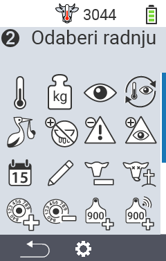
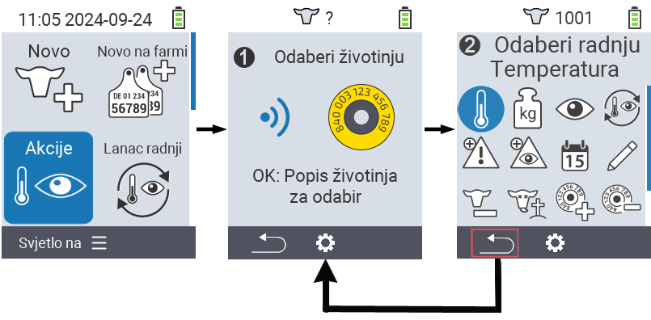
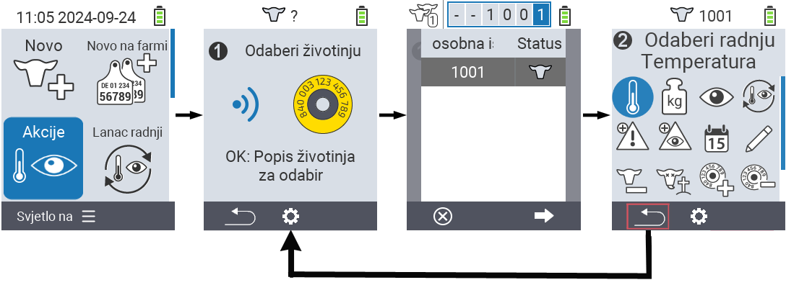

## Dostupne radnje {#available-actions}

Ovisno o vrsti životinje, možete izvršiti do 16 različitih radnji na životinji.

<map name="workmap">
  <area shape="rect" coords="3,100,60,165" alt="Temperatura" title="Izmjerite temperaturu kod svojih životinja&#10;Klik mišem: otvorite dokumentaciju" href="/hr/docs/actions/measure-temperature/">
  <area shape="rect" coords="60,100,118,165" alt="Vaganje" title="Zabilježite težinu svojih životinja&#10;Klik mišem: otvorite dokumentaciju" href="/hr/docs/actions/record-weight/">
  <area shape="rect" coords="118,100,174,165" alt="Ocjenjivanje" title="Ocijenite svoje životinje&#10;Klik mišem: otvorite dokumentaciju" href="/hr/docs/actions/rating/">
  <area shape="rect" coords="174,100,230,165" alt="Lanac radnji" title="Primjena i postavljanje lanca radnji&#10;Klik mišem: otvorite dokumentaciju" href="/hr/docs/chain-of-actions/">
   <area shape="rect" coords="3,165,60,225" alt="Teljenje" title="Registrirajte teljenje&#10;Klik mišem: otvorite dokumentaciju" href="/hr/docs/actions/calving/">
   <area shape="rect" coords="60,165,120,225" alt="Zasušivanje" title="Zasušite kravu ili je dodajte na popis svježih krava&#10;Klik mišem: otvorite dokumentaciju" href="/hr/docs/actions/dry-off/">
   <area shape="rect" coords="120,165,175,225" alt="Alarm" title="Dodajte i uklonite životinje s popisa alarma&#10;Klik mišem: otvorite dokumentaciju" href="/hr/docs/actions/alarm/">
   <area shape="rect" coords="175,165,230,225" alt="Na promatranju" title="Stavite životinje na popis za promatranje ili ih uklonite&#10;Klik mišem: otvorite dokumentaciju" href="/hr/docs/actions/on-watch/">
   <area shape="rect" coords="3,225,60,280" alt="Povijest životinje" title="Pogledajte povijest životinje&#10;Klik mišem: otvorite dokumentaciju" href="/hr/docs/actions/animal-history/">
   <area shape="rect" coords="60,225,120,280" alt="Uredi" title="Uredite podatke odabrane životinje&#10;Klik mišem: otvorite dokumentaciju" href="/hr/docs/actions/edit/">
   <area shape="rect" coords="120,225,175,280" alt="Odjava" title="Odjavite životinju&#10;Klik mišem: otvorite dokumentaciju" href="/hr/docs/actions/unregister/">
   <area shape="rect" coords="175,225,230,280" alt="Gubitak životinje" title="Registrirajte gubitak životinje&#10;Klik mišem: otvorite dokumentaciju" href="/hr/docs/actions/animal-loss/">
   <area shape="rect" coords="3,280,60,337" alt="Poveži transponder" title="Dodijelite transponder životinji&#10;Klik mišem: otvorite dokumentaciju" href="/hr/docs/actions/link-transponder/">
   <area shape="rect" coords="55,280,120,337" alt="Odspoji transponder" title="Uklonite vezu transpondera sa životinjom&#10;Klik mišem: otvorite dokumentaciju" href="/hr/docs/actions/unlink-transponder/">
   <area shape="rect" coords="120,280,175,337" alt="Ručno poveži ID životinje" title="Dodijelite nacionalni ID životinji koja nema nacionalni ID&#10;Klik mišem: otvorite dokumentaciju" href="/hr/docs/actions/link-animal-id/#link-animal-id">
   <area shape="rect" coords="175,280,230,337" alt="Poveži ID životinje skeniranjem" title="Dodijelite nacionalni ID životinji koja nema nacionalni ID&#10;Klik mišem: otvorite dokumentaciju" href="/hr/docs/actions/link-animal-id/#link-animal-id-with-electronic-ear-tag-scan">

<area shape="rect" coords="100,340,140,375" alt="Settings" title="Pozivanje postavki&#10;Klik mišem: na dokumentaciju" href="/hr/docs/actions/setting/">
</map>

{}
Svaka akcija je identificirana simbolom. Pomaknite pokazivač miša preko simbola u donjoj grafici i ostavite ga na trenutak. Pojavit će se tooltip koji prikazuje informacije o odgovarajućoj akciji. Ako kliknete na jedan od simbola, bit ćete preusmjereni na opis odgovarajuće akcije.
{}

## Opći postupak {#general-procedure}

Unutar izbornika  `` možete odabrati sljedeću životinju u bilo kojem trenutku bez napuštanja stavke izbornika Akcije. Da biste odabrali sljedeću životinju, postupite na sljedeći način:

1. Odaberite stavku izbornika  `` na glavnom zaslonu vašeg VitalControl uređaja i pritisnite gumb ``.

2. Ili skenirajte životinju pomoću transpondera ili odaberite životinju s popisa. Potvrdite pritiskom na `` i odaberite životinju pomoću tipki sa strelicama △ ▽. Potvrdite s ``.

3. Otvorit će se podizbornik u kojem ćete pronaći ikone za brojne akcije za životinje. Koristite tipke sa strelicama za odabir željene akcije i započnite akciju pritiskom na gumb ``. Ovisno o odabranoj akciji, pojavit će se jedan ili više zaslona ili skočni prozor.

4. Ako želite, sada možete odabrati i izvršiti drugu akciju za trenutnu životinju.

5. Nakon što ste izvršili željenu(e) akciju(e) za životinju, vratite se na korak 2 'Odabir životinje'. Da biste to učinili, pritisnite lijevi gumb `F1` ispod simbola `` u donjem lijevom kutu podnožja.

6. Prozor iz koraka dva će se ponovno automatski otvoriti i možete odabrati sljedeću životinju ili se vratiti u glavni izbornik pritiskom na gumb `F1` ispod simbola ``.



{}

{}
{}

{}


