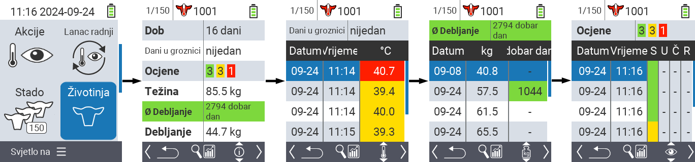
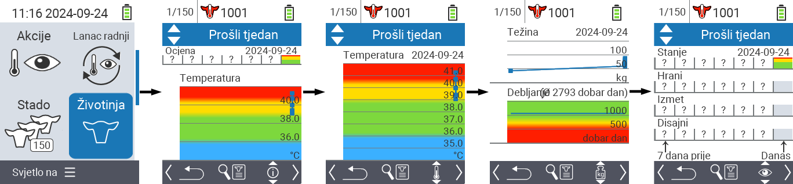
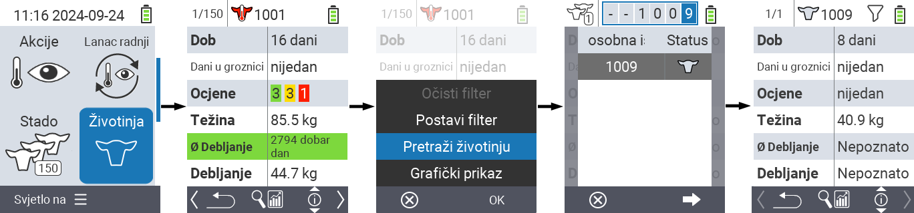
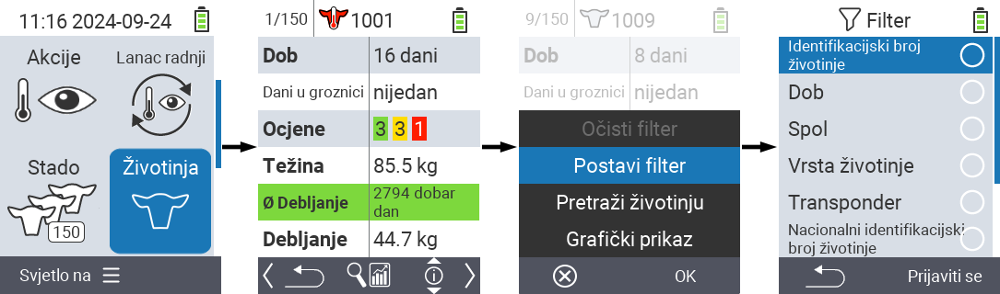

## Životinja {#animal}

Funkcija pojedinačne životinje omogućuje vam pregled važnih informacija o težini, temperaturi i ocjeni za svaku pojedinu životinju. Uvijek imate mogućnost prikaza informacija kao grafiku ili kao popis. Da biste koristili funkciju pojedinačne životinje, postupite na sljedeći način:

1. Na glavnom zaslonu vašeg VitalControl uređaja odaberite stavku izbornika  `` i pritisnite gumb ``.

2. Otvara se pregled najvažnijih informacija o životinji. Gornji rub zaslona prikazuje vam koju životinju trenutno pregledavate. Koristite tipku `F3` za odabir između informacija o životinji , temperaturi , težini  i ocjeni .

{}
Unutar svakog prikaza informacija imate mogućnost [pretraživanja životinje](#search-animal), postavljanja [filtera](#set-filter) i prebacivanja na [grafički prikaz](#set-graphical-view).
Također možete u bilo kojem trenutku prebacivati između pojedinačnih životinja pomoću tipki sa strelicama ◁ ▷.
{}

### Postavi grafički prikaz {#set-graphical-view}

1. Pritisnite srednji gornji gumb `On/Off`  kako biste otvorili skočni izbornik. U ovom izborniku možete birati između funkcija ``, `` ili ``.

2. Odaberite `` pomoću tipki sa strelicama △ ▽ i potvrdite s ``.

### Pretraži životinju {#search-animal}

1. Pritisnite srednju gornju tipku `On/Off`  kako biste otvorili skočni izbornik. U ovom izborniku možete birati između funkcija ``, `` ili ``.

2. Odaberite `` pomoću tipki sa strelicama △ ▽ i potvrdite s ``.

3. Koristite tipke sa strelicama △ ▽ ◁ ▷ za odabir željenog broja životinje i potvrdite s ``

### Postavi filter {#set-filter}

1. Pritisnite srednju gornju tipku `On/Off`  kako biste otvorili skočni izbornik. U ovom izborniku možete birati između funkcija ``, `` ili ``.

2. Odaberite `` pomoću tipki sa strelicama △ ▽ i potvrdite s ``.
Upute za korištenje filtera možete pronaći [ovdje]().

