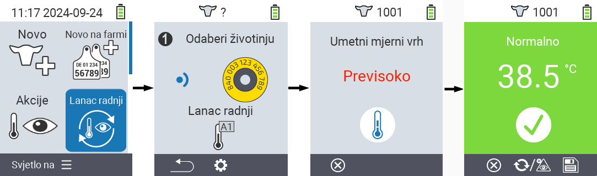
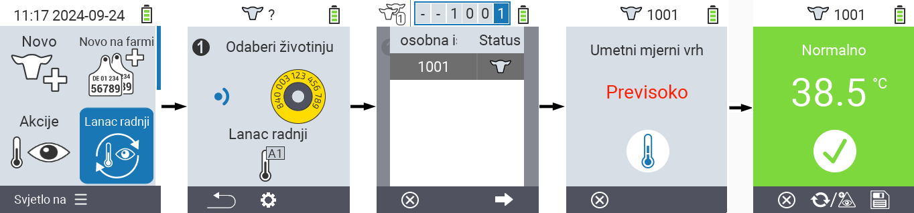
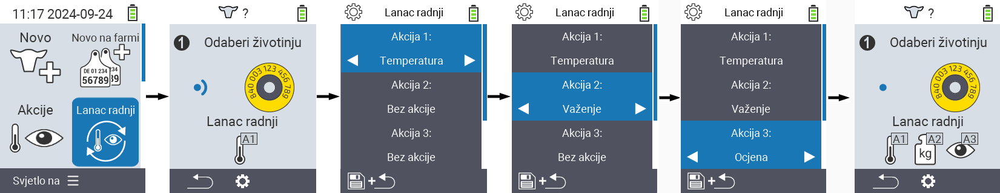

## Lanac akcija {#chain-of-actions}

Lanac akcija omogućuje vam automatsko izvršavanje nekoliko akcija za životinju jednu za drugom. Na primjer, možete odabrati akcije `` i ``. Ako zatim izvršite lanac akcija, možete prvo izmjeriti temperaturu svoje životinje i odmah nakon toga zabilježiti ocjenu.

### Korištenje lanca akcija {#use-chain-of-actions}

1. Na glavnom ekranu vašeg VitalControl uređaja odaberite stavku izbornika &nbsp;&nbsp; `` i pritisnite gumb ``.

2. Ili skenirajte životinju pomoću transpondera ili potvrdite s `` i koristite tipke sa strelicama △ ▽ ◁ ▷ za unos željenog ID-a životinje.

3. Lanac akcija se sada izvršava. Čim se sve akcije u lancu akcija izvrše, može se izravno odabrati sljedeća životinja.



{}

{}
{}

{}


### Postavljanje lanca akcija {#set-chain-of-actions}

1. Na glavnom ekranu vašeg VitalControl uređaja odaberite stavku izbornika &nbsp;&nbsp; `` i pritisnite gumb ``.

2. Koristite gumb `F2` &nbsp;&nbsp; (``).

3. Pojavit će se zaslonski preklopnik. Koristite tipke sa strelicama △ ▽ za odabir između navedenih radnji 1 - 4 (možete izvesti do četiri radnje zaredom). Koristite tipke sa strelicama ◁ ▷ za odabir željene radnje za odgovarajuću radnju. Spremite postavke s tipkom `F1` &nbsp;&nbsp;.

4. Ako želite resetirati cijeli lanac radnji, odaberite opciju `` u podizborniku koristeći tipke sa strelicama △ ▽ i potvrdite s ``.

    

{}
Unutar pojedinačnih radnji imate iste opcije postavki kao što je opisano u poglavlju [Radnje](../actions) za svaku pojedinačnu radnju.
{}

{}
Simboli na početnom zaslonu lanca radnji pokazuju koje ste radnje postavili i kojim redoslijedom.
{}
