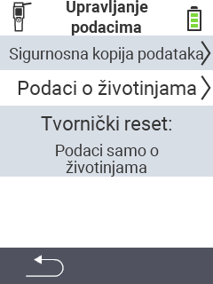

{}
Ako kliknete na stavku izbornika, bit ćete preusmjereni na opis odgovarajuće funkcije.
{}

<map name="workmap">
  <area shape="rect" coords="2,40,238,80" alt="Sigurnosna kopija podataka" title="Upute za izradu sigurnosne kopije možete pronaći ovdje&#10;Klik mišem: otvorite dokumentaciju" href="/hr/docs/device/data-management/data-backup/">

  <area shape="rect" coords="2,80,238,120" alt="Podaci o životinjama" title="Upute za vraćanje sigurnosne kopije možete pronaći ovdje&#10;Klik mišem: otvorite dokumentaciju" href="/hr/docs/device/data-management/animal-data/">

  <area shape="rect" coords="2,120,238,200" alt="Vraćanje na tvorničke postavke" title="Sve informacije i upute za resetiranje uređaja i podataka o životinjama možete pronaći ovdje&#10;Klik mišem: otvorite dokumentaciju" href="/hr/docs/reset/">

  <area shape="rect" coords="2,282,120,319" alt="Natrag" title="Sve informacije i upute za izvoz podataka o životinjama možete pronaći ovdje&#10;Klik mišem: otvorite dokumentaciju" href="/hr/docs/device/">
</map>
