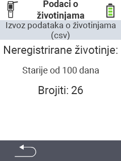

<map name="workmap">
  <area shape="rect" coords="2,40,238,80" alt="Izvoz podataka o životinjama (csv)" title="Izvoz podataka o životinjama&#10;Klik mišem: otvori dokumentaciju" href="/hr/docs/data-export/usb-drive/">

  <area shape="rect" coords="2,80,238,200" alt="Odjava životinja" title="Odredite dob od koje životinje treba odjaviti&#10;Klik mišem: otvori dokumentaciju" href="/hr/docs/device/data-management/animal-data/unregister-animal/">

  <area shape="rect" coords="2,282,120,319" alt="Natrag" title="Sve informacije i upute za izvoz podataka o životinjama možete pronaći ovdje&#10;Klik mišem: otvori dokumentaciju" href="/hr/docs/device/data-management/">
</map>
