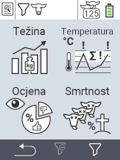

{}
Ako kliknete na stavku izbornika, bit ćete preusmjereni na opis odgovarajuće funkcije.
{}

<map name="workmap">
  <area shape="rect" coords="3,40,116,160" alt="Težina" title="Procijenite svoje pohranjene podatke u odjeljku Težina&#10;Klik mišem: otvorite dokumentaciju" href="/hr/docs/evaluation/weight/">
  <area shape="rect" coords="3,160,116,279" alt="Ocjena" title="Procijenite svoje pohranjene podatke u odjeljku Ocjena&#10;Klik mišem: otvorite dokumentaciju" href="/hr/docs/evaluation/rating/">

  <area shape="rect" coords="116,40,238,160" alt="Temperatura" title="Procijenite svoje pohranjene podatke u odjeljku Temperatura&#10;Klik mišem: otvorite dokumentaciju" href="/hr/docs/evaluation/temperature/">
  <area shape="rect" coords="116,160,238,279" alt="Mortalitet" title="Procijenite svoje pohranjene podatke u odjeljku Mortalitet&#10;Klik mišem: otvorite dokumentaciju" href="/hr/docs/evaluation/mortality/">

  <area shape="rect" coords="150,282,238,319" alt="Filter" title="Postavite filter&#10;Klik mišem: na dokumentaciju" href="/hr/docs/filter">
  <area shape="rect" coords="2,282,95,319" alt="Natrag" title="Vratite se jednu razinu unatrag&#10;Klik mišem: na dokumentaciju" href="/hr/docs/menu/mainmenu/">
</map>
