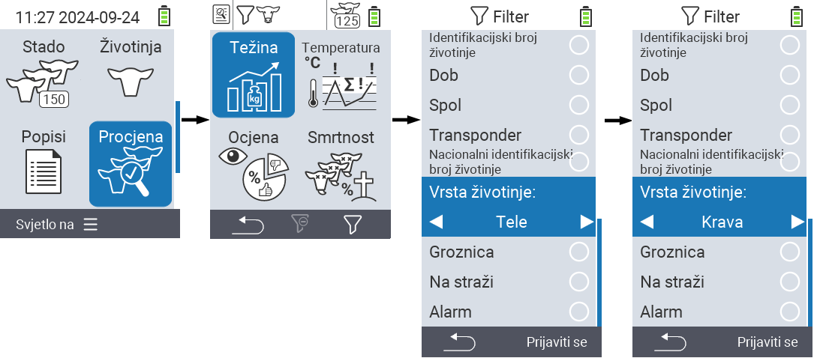
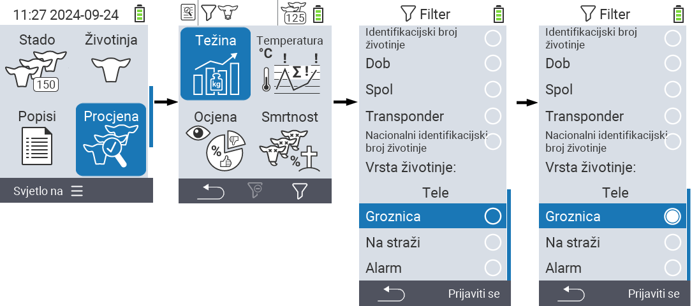

## Primjena filtara {#applying-filters}

{}
Filter vam pomaže izvršiti odabir koristeći kriterije filtra unutar stavki izbornika ``, `` i `` uređaja VitalControl. Čim primijenite filter, simboli za različite kriterije filtra pojavljuju se na vrhu zaslona. Ovi simboli pomažu vam saznati jesu li i koji kriteriji filtra aktivirani. Na primjer, ako postavite filter `` na muški, uređaj će koristiti samo muške životinje. Na primjer, ako također aktivirate filter ``, uređaj će koristiti samo muške životinje koje su na popisu za promatranje.
{}

Da biste stvorili filter u evaluacijama, postupite na sljedeći način:

1. U podizborniku koji pripada gornjoj stavci izbornika  `` pritisnite tipku `F3`  jednom. Unutar podizbornika koji pripadaju gornjim stavkama izbornika  `` i  ``, morate pritisnuti tipku dvaput.

2. Otvara se podizbornik u kojem možete postaviti sve opcije filtra. Možete filtrirati prema ``, ``, ``, ``, ``, ``, ``, `` i ``.

3. Za filtre ``, ``, `` i `` navigirajte do odgovarajućeg područja i potvrdite s ``. Koristite tipke sa strelicama ◁ ▷ za određivanje željene postavke. Koristite tipku `F3` `` za postavljanje odabrane postavke. Da biste odbacili promjene filtra, pritisnite tipku `F1` &nbsp;&nbsp;.

4. Za filtre `` i `` odaberite odgovarajući kriterij i potvrdite s ``. Sada će vam biti prikazana donja i gornja granica. Navigirajte do željene granice pomoću tipki sa strelicama △ ▽ i potvrdite pritiskom na `` dvaput. Sada možete postaviti željeni broj pomoću tipki sa strelicama ◁ ▷ i tipki sa strelicama △ ▽. Kada su sve postavke ispravne, pritisnite `` ponovno kako biste izašli iz načina postavljanja i primijenili odabrani(e) filter(e) s tipkom `F3` ``. Pomoću tipke `F1` &nbsp;&nbsp;, možete odbaciti svoje promjene ako želite.

5. Za filtre ``, `` i `` postoji mogućnost onemogućavanja ili omogućavanja njihove primjene. Da biste to učinili, odaberite odgovarajući filter i potvrdite s ``. Filter je sada aktivan. Ponovno potvrdite s `` kako biste deaktivirali filter.

6. Kada postavite sve filtre, koristite tipku `F3` `` kako biste primijenili definirane filtre ili pritisnite tipku `F1`  kako biste odbacili svoje promjene na filterima.
