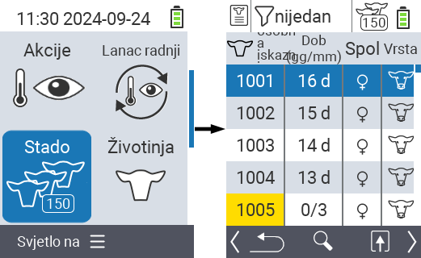
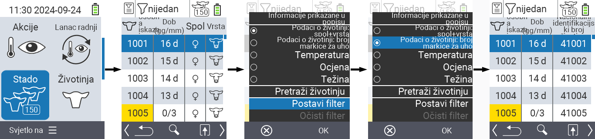
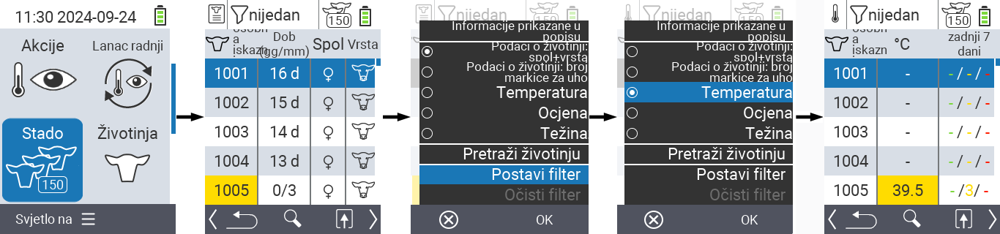
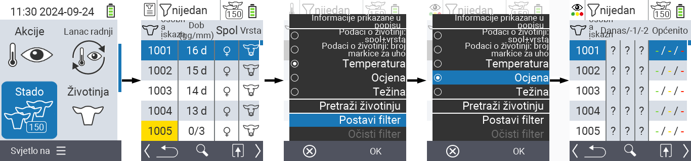
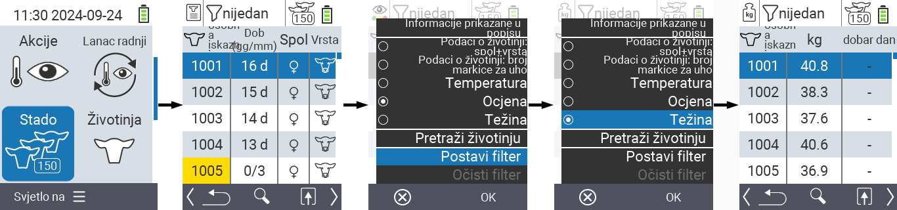
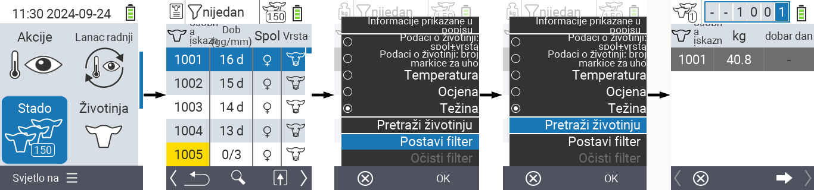
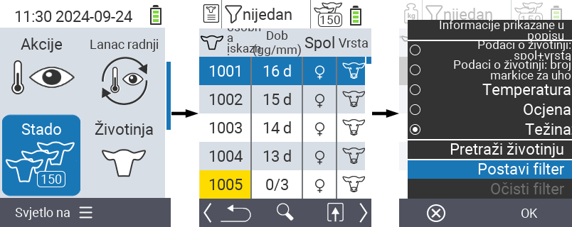
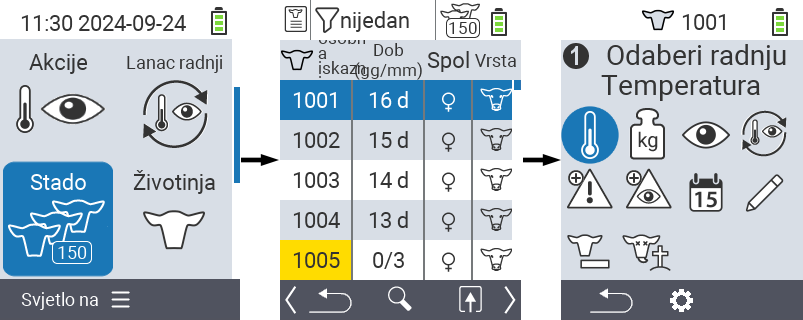

## Stado {#herd}

Unutar stavke izbornika Stado, možete pregledati cijelo svoje stado, pretraživati pojedinačne životinje i prikazivati važne informacije. Imate sljedeće mogućnosti:

- Pogledajte [podatke o životinjama](#view-animal-data)
- Pogledajte [podatke o temperaturi](#display-temperature)
- Pogledajte [podatke o ocjeni](#view-rating)
- Pogledajte [podatke o težini](#view-rating)
- [Pretraži životinju](#search-animal)
- Postavite [filter](#set-filter)
- [Radnje](#call-action-menu)

### Pripremni koraci {#preparatory-steps}

1. Na glavnom ekranu vašeg VitalControl uređaja, odaberite stavku izbornika  `` i pritisnite gumb ``.

2. Otvorit će se pregled vašeg stada.

    

### Pogledajte podatke o životinjama {#view-animal-data}

1. Dovršite pripremne korake.

2. Koristite tipku `F3` &nbsp;&nbsp; za pozivanje popup izbornika koji prikazuje kategorije informacija koje se mogu prikazati za popis stada. Koristite tipke sa strelicama △ ▽ za označavanje linije `` ili `` i odaberite ovu kategoriju pritiskom na središnji gumb `` ili tipku `F3` ``. Dvije opcije odabira razlikuju se u prikazu informacijske trake.

3. Podaci o životinjama sada će biti prikazani kao sadržaj popisa stada.

4. Alternativno, možete koristiti tipke sa strelicama ◁ ▷ za prebacivanje između različitih opcija prikaza.

    

{}
Podaci o životinjama prikazuju se prema zadanim postavkama. Samo kada imate prikazanu težinu, na primjer, morate ponovno postaviti prikaz podataka o životinjama.
{}

### Prikaz temperature {#display-temperature}

1. Dovršite pripremne korake.

2. Koristite tipku `F3` &nbsp;&nbsp; za otvaranje skočnog izbornika koji prikazuje kategorije informacija koje se mogu prikazati za popis stada. Koristite tipke sa strelicama △ ▽ za označavanje linije `` i odaberite ovu kategoriju pritiskom na središnju tipku `` ili tipku `F3` ``.

3. Podaci o temperaturi sada će biti prikazani kao sadržaj popisa stada.

4. Alternativno, možete koristiti tipke sa strelicama ◁ ▷ za prebacivanje između različitih opcija prikaza.

    

### Prikaz ocjene {#view-rating}

1. Dovršite pripremne korake.

2. Koristite tipku `F3` &nbsp;&nbsp; za otvaranje skočnog izbornika koji prikazuje kategorije informacija koje se mogu prikazati za popis stada. Koristite tipke sa strelicama △ ▽ za označavanje linije `` i odaberite ovu kategoriju pritiskom na središnju tipku `` ili tipku `F3` ``.

3. Podaci o ocjeni sada će biti prikazani kao sadržaj popisa stada.

4. Alternativno, možete koristiti tipke sa strelicama ◁ ▷ za prebacivanje između različitih opcija prikaza.

    

### Prikaz težine {#display-weight}

1. Dovršite pripremne korake.

2. Koristite tipku `F3` &nbsp;&nbsp; za otvaranje skočnog izbornika koji prikazuje kategorije informacija koje se mogu prikazati za popis stada. Koristite tipke sa strelicama △ ▽ za označavanje linije `` i odaberite ovu kategoriju pritiskom na središnju tipku `` ili tipku `F3` ``.

3. Podaci o težini sada će biti prikazani kao sadržaj popisa stada.

4. Alternativno, možete koristiti tipke sa strelicama ◁ ▷ za prebacivanje između različitih opcija prikaza.

### Pretraži životinju {#search-animal}

1. Dovršite pripremne korake.

2. Koristite tipku `F3` &nbsp;&nbsp; za pozivanje popup izbornika koji prikazuje razne opcije. Koristite tipke sa strelicama △ ▽ za označavanje funkcije `` i pokrenite funkciju pretraživanja pritiskom na središnju tipku `` ili tipku `F3` ``. Alternativno, možete koristiti tipku `On/Off`  odmah nakon prvog koraka.

3. Koristite tipke sa strelicama △ ▽ ◁ ▷ za unos željenog broja životinje i potvrdite s ``.

### Postavi filter {#set-filter}

1. Dovršite pripremne korake.

2. Koristite tipku `F3` &nbsp;&nbsp; za pozivanje popup izbornika koji prikazuje razne opcije. Koristite tipke sa strelicama △ ▽ za označavanje funkcije `` i pokrenite funkciju filtera pritiskom na središnju tipku `` ili tipku `F3` ``.

3. Kako primijeniti filter možete pronaći [ovdje]().

### Pozovi akcijski izbornik {#call-action-menu}

Uvijek imate opciju pozvati akcijski izbornik za životinju.

1. Dovršite pripremne korake.

2. Odaberite životinju s popisa pomoću tipki sa strelicama △ ▽ i potvrdite s ``.

3. Akcijski izbornik je sada otvoren. Kako ga koristiti možete pronaći [ovdje](../actions).

4. Vratite se na popis stada s tipkom `F3`.

