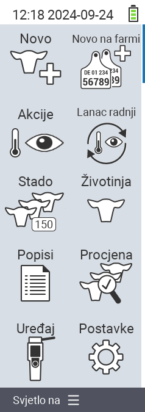

{}
Ako kliknete na stavku izbornika, bit ćete preusmjereni na opis odgovarajuće funkcije.
{}

<map name="workmap">
  <area shape="rect" coords="3,40,116,160" alt="Novo" title="Kreiraj nove životinje&#10;Klik mišem: otvori dokumentaciju" href="/hr/docs/new/">
  <area shape="rect" coords="3,160,116,280" alt="Akcije" title="Akcije na životinjama&#10;Klik mišem: otvori dokumentaciju" href="/hr/docs/actions/">
  <area shape="rect" coords="3,280,116,400" alt="Stado" title="Izbornik stada&#10;Klik mišem: otvori dokumentaciju" href="/hr/docs/herd/">
  <area shape="rect" coords="3,400,116,520" alt="Popisi" title="Popisi životinja&#10;Klik mišem: otvori dokumentaciju" href="/hr/docs/lists/">
  <area shape="rect" coords="3,520,116,634" alt="Uređaj" title="Uređaj&#10;Klik mišem: otvori dokumentaciju" href="/hr/docs/device/">

  <area shape="rect" coords="116,40,230,160" alt="Novo na farmi" title="Pristup životinjama&#10;Klik mišem: otvori dokumentaciju" href="/hr/docs/new-on-farm/">
  <area shape="rect" coords="116,160,230,280" alt="Lanac akcija" title="Lanac akcija&#10;Klik mišem: otvori dokumentaciju" href="/hr/docs/chain-of-actions/">
  <area shape="rect" coords="116,280,230,400" alt="Životinja" title="Životinja&#10;Klik mišem: otvori dokumentaciju" href="/hr/docs/animal/">
  <area shape="rect" coords="116,400,230,520" alt="Procjena" title="Procjena&#10;Klik mišem: otvori dokumentaciju" href="/hr/docs/evaluation/">
  <area shape="rect" coords="116,520,230,634" alt="Postavke" title="Postavke&#10;Klik mišem: otvori dokumentaciju" href="/hr/docs/settings/">
</map>
