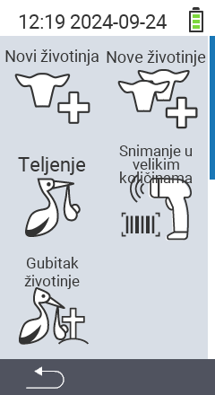

Putem glavne stavke izbornika  `` dolazite do podizbornika, gdje je za odabir predstavljeno 5 podstavki:

<map name="workmap">
  <area shape="rect" coords="3,40,116,160" alt="Nova životinja" title="Kako registrirati novu životinju pomoću uređaja VitalControl&#10;Klik mišem: otvori dokumentaciju" href="/hr/docs/new/animal/">
  <area shape="rect" coords="3,160,116,280" alt="Teljenje" title="Kako registrirati novo teljenje pomoću uređaja VitalControl&#10;Klik mišem: otvori dokumentaciju" href="/hr/docs/new/calving/">
  <area shape="rect" coords="3,280,116,399" alt="Gubitak životinje" title="Kako registrirati gubitak životinje pomoću uređaja VitalControl&#10;Klik mišem: otvori dokumentaciju" href="/hr/docs/new/animal-loss/">

  <area shape="rect" coords="116,40,230,160" alt="Nove životinje" title="Kako stvoriti više novih životinja na uređaju VitalControl pomoću jedne radnje&#10;Klik mišem: otvori dokumentaciju" href="/hr/docs/new/animals/">
  <area shape="rect" coords="116,160,230,280" alt="Skupno snimanje" title="Koristite skener barkoda za snimanje raznih životinja&#10;Klik mišem: otvori dokumentaciju" href="/hr/docs/new/bulk-recording/">

  <area shape="rect" coords="1,401,100,439" alt="Natrag" title="Skoči natrag jednu razinu&#10;Klik mišem: na dokumentaciju" href="/hr/docs/menu/mainmenu/">
</map>

{}
Svaki podizbornik nosi vlastitu ikonu. Pomaknite pokazivač miša preko ikone na gornjoj grafici i pustite ga da se zadrži na trenutak. Pojavit će se alatni savjet koji prikazuje informacije za odabrani podizbornik. Ako kliknete na jednu od ikona, bit ćete preusmjereni na opis odabrane stavke podizbornika.
{}

