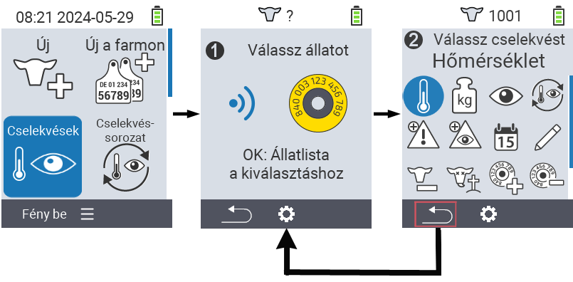
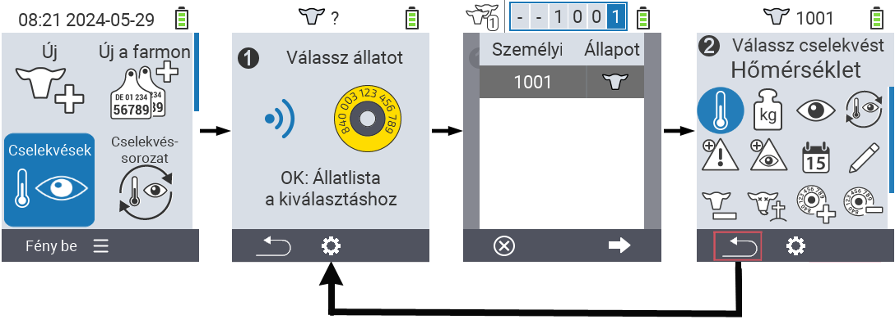

## Elérhető műveletek

Az állat típusától függően akár 16 különböző műveletet is végrehajthat egy állaton.

<map name="workmap">
  <area shape="rect" coords="3,100,60,165" alt="Hőmérséklet" title="Láz mérése az állatoknál&#10;Egérkattintás: dokumentáció megnyitása" href="/hu/docs/actions/measure-temperature/">
  <area shape="rect" coords="60,100,118,165" alt="Mérés" title="Az állatok súlyának rögzítése&#10;Egérkattintás: dokumentáció megnyitása" href="/hu/docs/actions/record-weight/">
  <area shape="rect" coords="118,100,174,165" alt="Értékelés" title="Az állatok értékelése&#10;Egérkattintás: dokumentáció megnyitása" href="/hu/docs/actions/rating/">
  <area shape="rect" coords="174,100,230,165" alt="Műveletek lánca" title="Műveletek láncának alkalmazása és beállítása&#10;Egérkattintás: dokumentáció megnyitása" href="/hu/docs/chain-of-actions/">
   <area shape="rect" coords="3,165,60,225" alt="Ellés" title="Ellés regisztrálása&#10;Egérkattintás: dokumentáció megnyitása" href="/hu/docs/actions/calving/">
   <area shape="rect" coords="60,165,120,225" alt="Szárazon állás" title="Tehén szárazon állítása vagy friss tehén listára helyezése&#10;Egérkattintás: dokumentáció megnyitása" href="/hu/docs/actions/dry-off/">
   <area shape="rect" coords="120,165,175,225" alt="Riasztás" title="Állatok hozzáadása és eltávolítása a riasztási listáról&#10;Egérkattintás: dokumentáció megnyitása" href="/hu/docs/actions/alarm/">
   <area shape="rect" coords="175,165,230,225" alt="Megfigyelés alatt" title="Állatok megfigyelési listára helyezése vagy eltávolítása&#10;Egérkattintás: dokumentáció megnyitása" href="/hu/docs/actions/on-watch/">
   <area shape="rect" coords="3,225,60,280" alt="Állat története" title="Egy állat történetének megtekintése&#10;Egérkattintás: dokumentáció megnyitása" href="/hu/docs/actions/animal-history/">
   <area shape="rect" coords="60,225,120,280" alt="Szerkesztés" title="A kiválasztott állat adatainak szerkesztése&#10;Egérkattintás: dokumentáció megnyitása" href="/hu/docs/actions/edit/">
   <area shape="rect" coords="120,225,175,280" alt="Kijelentkezés" title="Egy állat kijelentése&#10;Egérkattintás: dokumentáció megnyitása" href="/hu/docs/actions/unregister/">
   <area shape="rect" coords="175,225,230,280" alt="Állatveszteség" title="Állatveszteség regisztrálása&#10;Egérkattintás: dokumentáció megnyitása" href="/hu/docs/actions/animal-loss/">
   <area shape="rect" coords="3,280,60,337" alt="Transzponder hozzárendelése" title="Transzponder hozzárendelése egy állathoz&#10;Egérkattintás: dokumentáció megnyitása" href="/hu/docs/actions/link-transponder/">
   <area shape="rect" coords="55,280,120,337" alt="Transzponder leválasztása" title="Transzponder leválasztása egy állatról&#10;Egérkattintás: dokumentáció megnyitása" href="/hu/docs/actions/unlink-transponder/">
   <area shape="rect" coords="120,280,175,337" alt="Állat azonosító kézi hozzárendelése" title="Nemzeti állat azonosító hozzárendelése egy állathoz, amelynek nincs nemzeti állat azonosítója&#10;Egérkattintás: dokumentáció megnyitása" href="/hu/docs/actions/link-animal-id/#link-animal-id">
   <area shape="rect" coords="175,280,230,337" alt="Állat azonosító hozzárendelése szkenneléssel" title="Nemzeti állat azonosító hozzárendelése egy állathoz, amelynek nincs nemzeti állat azonosítója&#10;Egérkattintás: dokumentáció megnyitása" href="/hu/docs/actions/link-animal-id/#link-animal-id-with-electronic-ear-tag-scan">

   <area shape="rect" coords="100,340,140,375" alt="Beállítások" title="Beállítások előhívása&#10;Egérkattintás: a dokumentációhoz" href="/hu/docs/actions/settings/">
</map>

{}
Minden műveletet egy szimbólum azonosít. Mozgassa az egérmutatót egy szimbólum fölé az alábbi grafikában, és hagyja ott egy pillanatra. Megjelenik egy tooltip, amely információkat nyújt az adott műveletről. Ha rákattint egy szimbólumra, az adott művelet leírásához lesz átirányítva.
{}

## Általános eljárás

A menüben  `Műveletek` bármikor kiválaszthatja a következő állatot anélkül, hogy el kellene hagynia a Műveletek menüpontot. Az állat kiválasztásához kövesse az alábbi lépéseket:

1. Válassza ki a főképernyőn a  `Műveletek` menüpontot a VitalControl készülékén, és nyomja meg az `OK` gombot.

2. Vagy szkenneljen be egy állatot a transzponder segítségével, vagy válasszon egy állatot a listából. Erősítse meg az `OK` gomb megnyomásával, és válasszon egy állatot a △ ▽ nyílgombokkal. Erősítse meg az `OK` gombbal.

3. Megnyílik egy almenü, amelyben számos állatművelet ikonja található. Használja a nyílgombokat a kívánt művelet kiválasztásához, és indítsa el a műveletet az `OK` gomb megnyomásával. A kiválasztott művelettől függően egy vagy több képernyő vagy egy felugró ablak jelenik meg.

4. Ha szeretné, most kiválaszthat és végrehajthat egy másik műveletet az aktuális állatra.

5. Miután végrehajtotta a kívánt művelet(ek)et az állaton, térjen vissza a 2. lépéshez, az 'Állat kiválasztása' ponthoz. Ehhez nyomja meg a bal oldali `F1` gombot a `Vissza` szimbólum alatt a lábléc bal alsó sarkában.

6. Az ablak a második lépéstől automatikusan újra megnyílik, és kiválaszthatja a következő állatot, vagy visszatérhet a főmenübe az `F1` gomb megnyomásával a `Vissza` szimbólum alatt.



{}

{}
{}

{}


