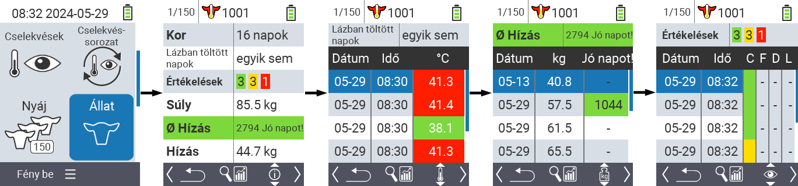
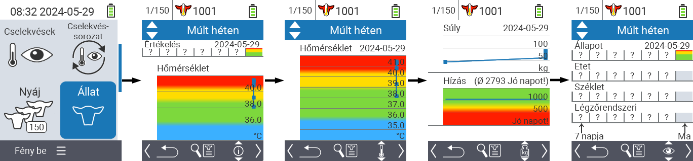
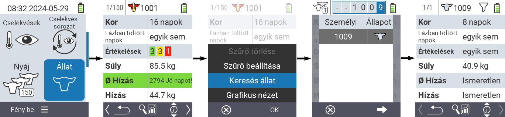
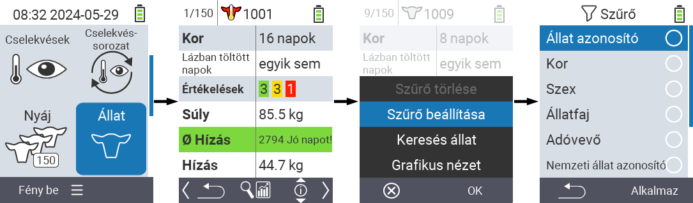

## Állat {#animal}

Az egyes állatok funkció lehetővé teszi, hogy megtekintse az egyes állatok súlyával, hőmérsékletével és értékelésével kapcsolatos fontos információkat. Mindig lehetősége van az információkat grafikusan vagy listaként megjeleníteni. Az egyes állatok funkció használatához kövesse az alábbi lépéseket:

1. A VitalControl készülék főképernyőjén válassza ki a  `` menüpontot, és nyomja meg az `` gombot.

2. Megnyílik a legfontosabb állatinformációk áttekintése. A képernyő felső szélén láthatja, melyik állatot nézi éppen. Az `F3` gombbal választhat az állatinformációk , hőmérséklet , súly  és értékelés  között.

{}
Minden információmegjelenítésen belül lehetősége van [állat keresésére](#search-animal), [szűrő beállítására](#set-filter) és [grafikus nézetre váltásra](#set-graphical-view).
Az egyes állatok között bármikor válthat a nyílgombokkal ◁ ▷.
{}

### Grafikus nézet beállítása {#set-graphical-view}

1. Nyomja meg a középső felső `On/Off` gombot  a felugró menü megnyitásához. Ebben a menüben választhat a ``, `` vagy `` funkciók között.

2. Válassza a `` opciót a △ ▽ nyílgombokkal, és erősítse meg az `` gombbal.

### Állat keresése {#search-animal}

1. Nyomja meg a középső felső `On/Off` gombot  a felugró menü megnyitásához. Ebben a menüben választhat a ``, `` vagy `` funkciók közül.

2. Válassza ki az `` opciót a △ ▽ nyílgombokkal, és erősítse meg az `` gombbal.

3. Használja a △ ▽ ◁ ▷ nyílgombokat a kívánt állatszám kiválasztásához, és erősítse meg az `` gombbal.

### Szűrő beállítása {#set-filter}

1. Nyomja meg a középső felső `On/Off` gombot  a felugró menü megnyitásához. Ebben a menüben választhat a ``, `` vagy `` funkciók közül.

2. Válassza ki a `` opciót a △ ▽ nyílgombokkal, és erősítse meg az `` gombbal.
Útmutatást a szűrő használatához [itt]() talál.

