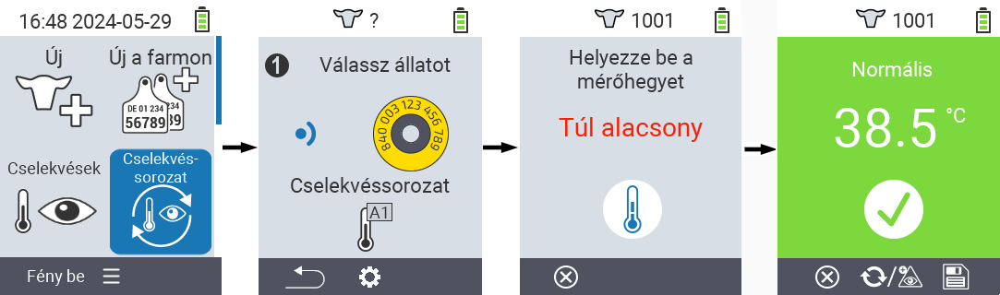
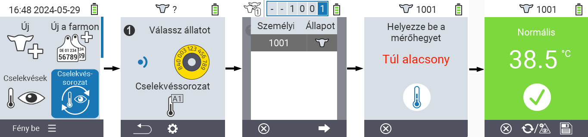
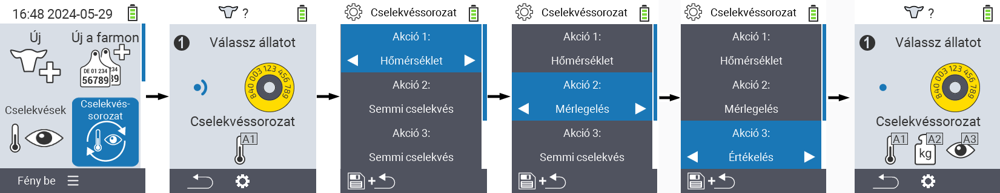

---
title: "Akciólánc: beállítás és használat"
linkTitle: "Akciólánc"
weight: 15
date: 2023-07-28T13:25:28+02:00
draft: false
slug: chain-of-actions
description: >
 Több állati akció egymás utáni végrehajtása
categories: [Akciólánc]
tags: [Akciólánc, Akciók]
translationKey: action-chain
--- 
## Akciólánc {#chain-of-actions}

Az akciólánc lehetővé teszi, hogy automatikusan több akciót hajts végre egy állaton egymás után. Például kiválaszthatod a `` és `` akciókat. Ha ezután végrehajtod az akcióláncot, először megmérheted az állat hőmérsékletét, majd azonnal rögzítheted az értékelést.

### Akciólánc használata {#use-chain-of-actions}

1. A VitalControl készülék főképernyőjén válaszd ki a &nbsp;&nbsp; `` menüpontot és nyomd meg az `` gombot.

2. Vagy olvasd be az állatot a transzponder segítségével, vagy erősítsd meg az `` gombbal, és használd a △ ▽ ◁ ▷ nyílgombokat a kívánt állat azonosítójának megadásához.

3. Az akciólánc most végrehajtásra kerül. Amint az akciólánc összes akciója végrehajtásra került, közvetlenül kiválasztható a következő állat.



{}

{}
{}

{}


### Akciólánc beállítása {#set-chain-of-actions}

1. A VitalControl készülék főképernyőjén válaszd ki a &nbsp;&nbsp; `` menüpontot és nyomd meg az `` gombot.

2. Használd az `F2` gombot &nbsp;&nbsp; (``).

3. Egy átfedő képernyő jelenik meg. Használd a △ ▽ nyílgombokat az 1 - 4 listázott akció közötti választáshoz (egymás után legfeljebb négy akciót hajthatsz végre). Használd a ◁ ▷ nyílgombokat a kívánt akció kiválasztásához az adott akcióhoz. Mentsd el a beállításokat az `F1` gombbal &nbsp;&nbsp;.

4. Ha az egész műveletsort vissza szeretné állítani, válassza a `` opciót az almenüben a △ ▽ nyílbillentyűkkel, és erősítse meg az `` gombbal.

    

{}
Az egyes műveleteken belül ugyanazok a beállítási lehetőségek állnak rendelkezésre, mint az [Műveletek](../actions) fejezetben leírtak az egyes műveletekhez.
{}

{}
A műveletsor kezdőképernyőjén található szimbólumok megmutatják, hogy mely műveleteket állította be és milyen sorrendben.
{}
