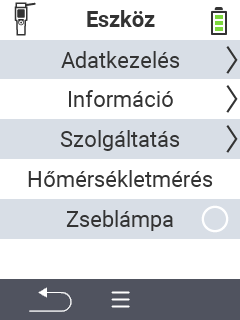

{}
Ha rákattint egy menüpontra, akkor az adott funkció leírásához lesz átirányítva.
{}

<map name="workmap">
  <area shape="rect" coords="2,40,238,80" alt="Adatkezelés" title="Adatmentések futtatása, adatok exportálása és az eszköz visszaállítása&#10;Egérkattintás: dokumentáció megnyitása" href="/hu/docs/device/data-management/">
  <area shape="rect" coords="2,80,238,120" alt="Információ" title="Fontos szoftver- és hardverinformációk megtekintése&#10;Egérkattintás: dokumentáció megnyitása" href="/hu/docs/device/info/">
  <area shape="rect" coords="2,120,238,160" alt="Szolgáltatás" title="Ellenőrizze az eszközmeghajtókat, frissítse a firmware-t és végezzen hatótávolság-tesztet&#10;Egérkattintás: dokumentáció megnyitása" href="/hu/docs/device/service/">
  <area shape="rect" coords="2,160,238,200" alt="Hőmérséklet mérés" title="Tesztelje az eszköz hőmérsékletmérését&#10;Egérkattintás: dokumentáció megnyitása" href="/hu/docs/device/temperature-measurement/">
  <area shape="rect" coords="2,200,238,240" alt="Zseblámpa" title="Kapcsolja be vagy ki a VitalControl eszköz fényét&#10;Egérkattintás: dokumentáció megnyitása" href="/hu/docs/device/flashlight/">

  <area shape="rect" coords="2,282,97,318" alt="Vissza" title="Ugrás egy szinttel vissza" href="/hu/docs/menu/mainmenu/">
</map>
