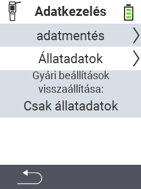

{}
Ha rákattint egy menüpontra, az adott funkció leírásához lesz irányítva.
{}

<map name="workmap">
  <area shape="rect" coords="2,40,238,80" alt="Adatmentés" title="Az adatmentés létrehozásának útmutatóját itt találja&#10;Egérkattintás: dokumentáció megnyitása" href="/hu/docs/device/data-management/data-backup/">

  <area shape="rect" coords="2,80,238,120" alt="Állati adatok" title="Az adatmentés visszaállításának útmutatóját itt találja&#10;Egérkattintás: dokumentáció megnyitása" href="/hu/docs/device/data-management/animal-data/">

  <area shape="rect" coords="2,120,238,200" alt="Gyári beállítások visszaállítása" title="Az eszköz és az állati adatok visszaállításának összes információját és útmutatóját itt találja&#10;Egérkattintás: dokumentáció megnyitása" href="/hu/docs/reset/">

  <area shape="rect" coords="2,282,120,319" alt="Vissza" title="Az állati adatok exportálásának összes információját és útmutatóját itt találja&#10;Egérkattintás: dokumentáció megnyitása" href="/hu/docs/device/">
</map>
