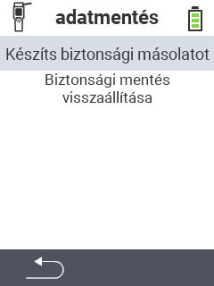

<map name="workmap">
  <area shape="rect" coords="2,40,238,80" alt="Biztonsági mentés létrehozása" title="A biztonsági mentés létrehozásának utasításai itt találhatók&#10;Egérkattintás: dokumentáció megnyitása" href="/hu/docs/backup/backup/">

  <area shape="rect" coords="2,80,238,120" alt="Biztonsági mentés visszaállítása" title="A biztonsági mentés visszaállításának utasításai itt találhatók&#10;Egérkattintás: dokumentáció megnyitása" href="/hu/docs/backup/restore/">

  <area shape="rect" coords="2,282,120,319" alt="Vissza" title="Ugrás egy szinttel vissza&#10;Egérkattintás: dokumentáció megnyitása" href="/hu/docs/device/data-management/">
</map>
