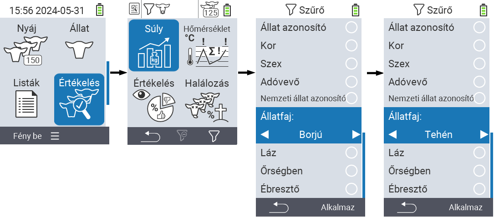
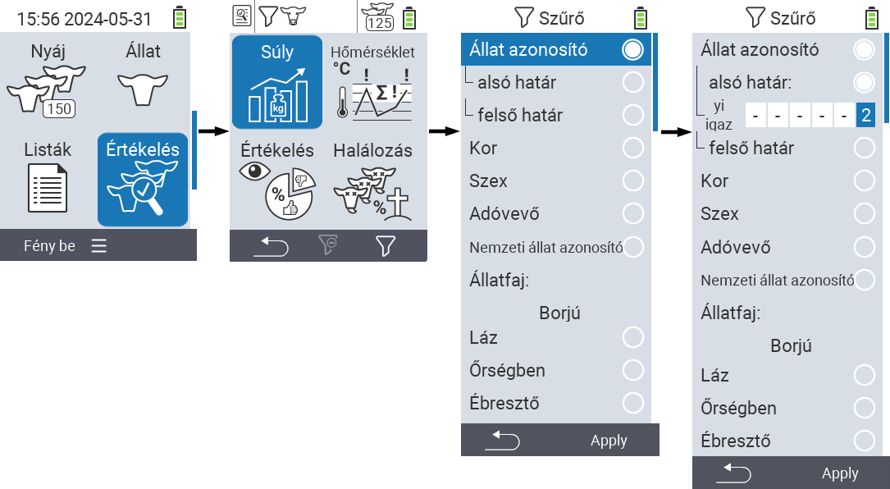

## Szűrők alkalmazása {#applying-filters}

{}
A szűrő segít a kiválasztás végrehajtásában a VitalControl eszköz ``, `` és `` menüpontjaiban található szűrési kritériumok segítségével. Amint alkalmaz egy szűrőt, a különböző szűrési kritériumok szimbólumai megjelennek a képernyő tetején. Ezek a szimbólumok segítenek megtudni, hogy mely szűrési kritériumok vannak aktiválva. Például, ha a `` szűrőt férfira állítja, az eszköz csak férfi állatokat fog használni. Ha például az `` szűrőt is aktiválja, az eszköz csak a megfigyelési listán szereplő férfi állatokat használja.
{}

Szűrő létrehozásához az értékelésekben, kövesse az alábbi lépéseket:

1. A felső menüpont  `` alá tartozó almenüben nyomja meg egyszer az `F3` gombot . A felső menüpontok  `` és  `` alá tartozó almenükben kétszer kell megnyomnia a gombot.

2. Megnyílik egy almenü, ahol beállíthatja az összes szűrési lehetőséget. Szűrhet ``, ``, ``, ``, ``, ``, ``, `` és `` alapján.

3. Az ``, ``, `` és `` szűrők esetében navigáljon a megfelelő területre és erősítse meg az `` gombbal. Használja a ◁ ▷ nyílgombokat a kívánt beállítás megadásához. Az `F3` gomb `` segítségével helyezze el a kiválasztott beállítást. A szűrő módosításainak elvetéséhez nyomja meg az `F1` gombot &nbsp;&nbsp;.

4. Az `` és `` szűrőknél válassza ki a megfelelő feltételt, majd erősítse meg `` gombbal. Most egy alsó és egy felső határ lesz látható. Navigáljon a kívánt határhoz a nyílbillentyűkkel △ ▽ és erősítse meg kétszer az `` gomb megnyomásával. Most beállíthatja a kívánt számot a nyílbillentyűkkel ◁ ▷ és a nyílbillentyűkkel △ ▽. Ha minden beállítás helyes, nyomja meg újra az `` gombot a beállítási mód elhagyásához, és alkalmazza a kiválasztott szűrő(ke)t az `F3` gomb `` megnyomásával. Az `F1` gomb &nbsp;&nbsp; megnyomásával elvetheti a módosításokat, ha szükséges.

5. A ``, `` és `` szűrőknél lehetőség van azok alkalmazásának letiltására vagy engedélyezésére. Ehhez válassza ki a megfelelő szűrőt, majd erősítse meg `` gombbal. A szűrő most aktív. Erősítse meg újra az `` gomb megnyomásával a szűrő deaktiválásához.

6. Miután beállította az összes szűrőt, használja az `F3` gombot `` a meghatározott szűrők alkalmazásához, vagy nyomja meg az `F1` gombot  a szűrő(k) módosításainak elvetéséhez.
