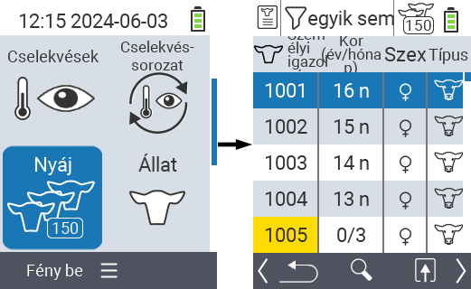
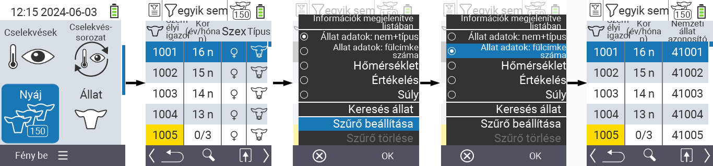
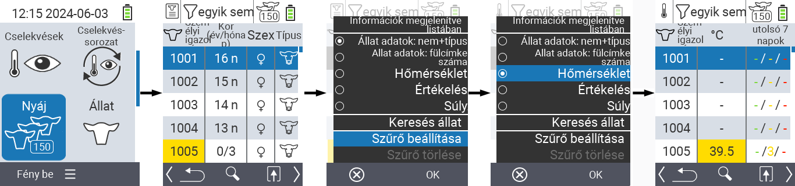
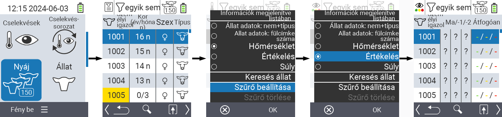
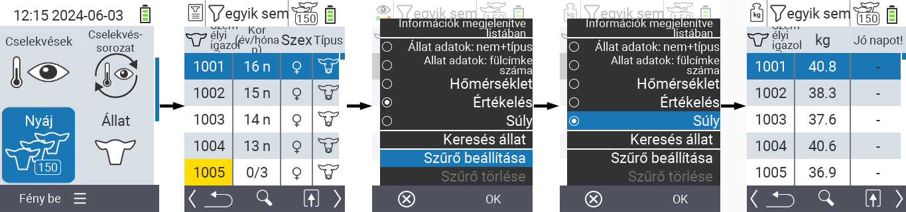
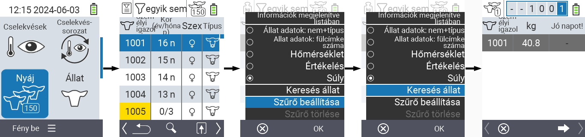
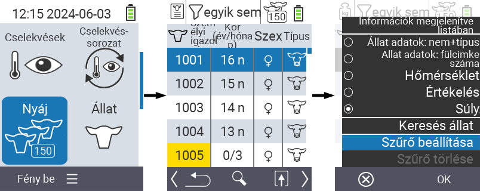
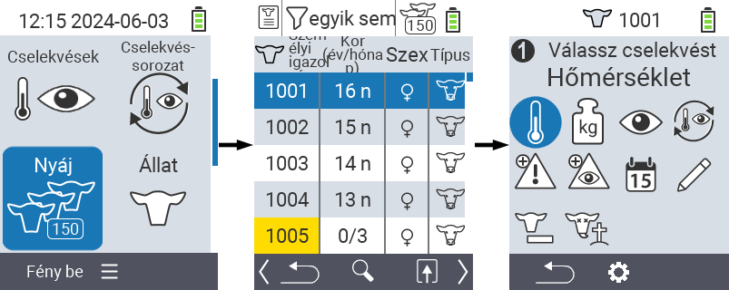

## Nyáj {#herd}

A Nyáj menüpontban megtekintheti az egész nyáját, kereshet egyedi állatokat és megjeleníthet fontos információkat. A következő lehetőségek állnak rendelkezésére:

- [Állat adatok](#view-animal-data) megtekintése
- [Hőmérséklet adatok](#display-temperature) megtekintése
- [Értékelési adatok](#view-rating) megtekintése
- [Súly adatok](#display-weight) megtekintése
- [Állat keresése](#search-animal)
- [Szűrő](#set-filter) beállítása
- [Műveletek](#call-action-menu)

### Előkészítő lépések {#preparatory-steps}

1. A VitalControl készülék főképernyőjén válassza ki a  `Nyáj` menüpontot, és nyomja meg az `OK` gombot.

2. Megnyílik a nyáj áttekintése.

    

### Állat adatok megtekintése {#view-animal-data}

1. Végezze el az előkészítő lépéseket.

2. Használja az `F3` gombot &nbsp;&nbsp; egy felugró menü megnyitásához, amely felsorolja azokat az információs kategóriákat, amelyek megjeleníthetők a nyájlistában. Használja a △ ▽ nyilakat a `Állat adatok: nem + típus` vagy `Állat adatok: N0 fülcímke` sor kiemeléséhez, és válassza ki ezt a kategóriát a központi `OK` gomb vagy az `F3` gomb `OK` megnyomásával. A két választási lehetőség az információs sáv megjelenítésében különbözik.

3. Az állat adatok mostantól a nyájlista tartalmaként jelennek meg.

4. Alternatívaként használhatja a ◁ ▷ nyilakat a különböző megjelenítési lehetőségek közötti váltáshoz.

    

{}
Alapértelmezés szerint először az állat adatok jelennek meg. Csak akkor kell újra beállítania az állat adatok megjelenítését, ha például a súlyt jeleníti meg.
{}

### Hőmérséklet megjelenítése {#display-temperature}

1. Végezze el az előkészítő lépéseket.

2. Használja az `F3` billentyűt &nbsp;&nbsp; egy felugró menü megjelenítéséhez, amely felsorolja azokat az információs kategóriákat, amelyek megjeleníthetők az állománylistában. Használja a nyílbillentyűket △ ▽ a `Hőmérséklet` sor kiemeléséhez, és válassza ki ezt a kategóriát a középső `OK` gomb vagy az `F3` billentyű `OK` megnyomásával.

3. A hőmérsékleti adatok mostantól az állománylista tartalmaként jelennek meg.

4. Alternatív megoldásként használhatja a nyílbillentyűket ◁ ▷ a különböző megjelenítési lehetőségek közötti váltáshoz.

    

### Értékelés megtekintése {#view-rating}

1. Végezze el az előkészítő lépéseket.

2. Használja az `F3` billentyűt &nbsp;&nbsp; egy felugró menü megjelenítéséhez, amely felsorolja azokat az információs kategóriákat, amelyek megjeleníthetők az állománylistában. Használja a nyílbillentyűket △ ▽ a `Értékelés` sor kiemeléséhez, és válassza ki ezt a kategóriát a középső `OK` gomb vagy az `F3` billentyű `OK` megnyomásával.

3. Az értékelési adatok mostantól az állománylista tartalmaként jelennek meg.

4. Alternatív megoldásként használhatja a nyílbillentyűket ◁ ▷ a különböző megjelenítési lehetőségek közötti váltáshoz.

    

### Súly megjelenítése {#display-weight}

1. Végezze el az előkészítő lépéseket.

2. Használja az `F3` billentyűt &nbsp;&nbsp; egy felugró menü megjelenítéséhez, amely felsorolja azokat az információs kategóriákat, amelyek megjeleníthetők az állománylistában. Használja a nyílbillentyűket △ ▽ a `Súly` sor kiemeléséhez, és válassza ki ezt a kategóriát a középső `OK` gomb vagy az `F3` billentyű `OK` megnyomásával.

3. A súlyadatok mostantól az állománylista tartalmaként jelennek meg.

4. Alternatív megoldásként használhatja a nyílbillentyűket ◁ ▷ a különböző megjelenítési lehetőségek közötti váltáshoz.

    

### Állat keresése {#search-animal}

1. Végezze el az előkészítő lépéseket.

2. Használja az `F3` billentyűt &nbsp;&nbsp; egy felugró menü megjelenítéséhez, amely különböző lehetőségeket sorol fel. Használja a nyílbillentyűket △ ▽ az `Állat keresése` funkció kiemeléséhez, és indítsa el a keresési funkciót a középső `OK` gomb vagy az `F3` billentyű `OK` megnyomásával. Alternatív megoldásként az `On/Off` gombot  is használhatja közvetlenül az első lépés után.

3. Használja a nyílbillentyűket △ ▽ ◁ ▷ a kívánt állatszám megadásához, és erősítse meg az `OK` gombbal.

    

### Szűrő beállítása {#set-filter}

1. Végezze el az előkészítő lépéseket.

2. Használja az `F3` billentyűt &nbsp;&nbsp; egy felugró menü megjelenítéséhez, amely különböző opciókat listáz. Használja a nyílbillentyűket △ ▽ a `Szűrő beállítása` funkció kiemeléséhez, és indítsa el a szűrő funkciót a központi `OK` gomb vagy az `F3` gomb `OK` megnyomásával.

3. A szűrő alkalmazásának módját [itt]() találja.

    

### Akciómenü hívása {#call-action-menu}

Mindig lehetősége van egy állat akciómenüjének megnyitására.

1. Végezze el az előkészítő lépéseket.

2. Válasszon ki egy állatot a listából a nyílbillentyűkkel △ ▽ és erősítse meg az `OK` gombbal.

3. Az akciómenü most nyitva van. Ennek használatát [itt](../actions) találja.

4. Térjen vissza a nyájlistához az `F3` gombbal.

    
