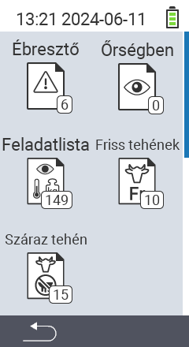

{}
Ha rákattint egy menüpontra, átirányítjuk a megfelelő funkció leírásához.
{}

<map name="workmap">
  <area shape="rect" coords="3,40,116,160" alt="Riasztási lista" title="Nézze meg a riasztási listáját&#10;Egérkattintás: dokumentáció megnyitása" href="/hu/docs/lists/alarm/">
  <area shape="rect" coords="3,160,116,280" alt="Akciólista" title="Nézze meg az akciólistáját&#10;Egérkattintás: dokumentáció megnyitása" href="/hu/docs/lists/actions/">
  <area shape="rect" coords="3,280,116,399" alt="Száraz tehenek listája" title="Nézze meg a száraz tehenek listáját&#10;Egérkattintás: dokumentáció megnyitása" href="/hu/docs/lists/dry-cows/">

  <area shape="rect" coords="116,40,230,160" alt="Megfigyelési lista" title="Nézze meg a megfigyelési listáját&#10;Egérkattintás: dokumentáció megnyitása" href="/hu/docs/lists/on-watch/">
  <area shape="rect" coords="116,160,230,280" alt="Friss tehenek" title="Nézze meg a friss tehenek listáját&#10;Egérkattintás: dokumentáció megnyitása" href="/hu/docs/lists/fresh-cows/">

  <area shape="rect" coords="2,401,115,438" alt="Vissza" title="Ugrás egy szinttel vissza" href="/hu/docs/menu/mainmenu/">
</map>
