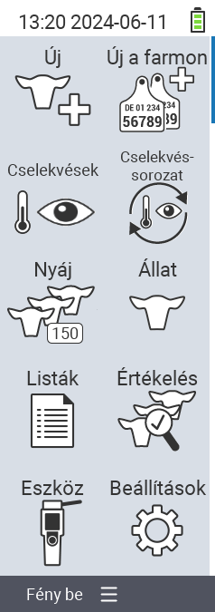

{}
Ha rákattint egy menüpontra, az adott funkció leírásához lesz átirányítva.
{}

<map name="workmap">
  <area shape="rect" coords="3,40,116,160" alt="Új" title="Új állatok létrehozása&#10;Egérkattintás: dokumentáció megnyitása" href="/hu/docs/new/">
  <area shape="rect" coords="3,160,116,280" alt="Műveletek" title="Műveletek az állatokon&#10;Egérkattintás: dokumentáció megnyitása" href="/hu/docs/actions/">
  <area shape="rect" coords="3,280,116,400" alt="Nyáj" title="Nyáj menü&#10;Egérkattintás: dokumentáció megnyitása" href="/hu/docs/herd/">
  <area shape="rect" coords="3,400,116,520" alt="Listák" title="Állatlisták&#10;Egérkattintás: dokumentáció megnyitása" href="/hu/docs/lists/">
  <area shape="rect" coords="3,520,116,634" alt="Eszköz" title="Eszköz&#10;Egérkattintás: dokumentáció megnyitása" href="/hu/docs/device/">

  <area shape="rect" coords="116,40,230,160" alt="Új a farmon" title="Állatok hozzáférése&#10;Egérkattintás: dokumentáció megnyitása" href="/hu/docs/new-on-farm/">
  <area shape="rect" coords="116,160,230,280" alt="Műveletek lánca" title="Műveletek lánca&#10;Egérkattintás: dokumentáció megnyitása" href="/hu/docs/chain-of-actions/">
  <area shape="rect" coords="116,280,230,400" alt="Állat" title="Állat&#10;Egérkattintás: dokumentáció megnyitása" href="/hu/docs/animal/">
  <area shape="rect" coords="116,400,230,520" alt="Értékelés" title="Értékelés&#10;Egérkattintás: dokumentáció megnyitása" href="/hu/docs/evaluation/">
  <area shape="rect" coords="116,520,230,634" alt="Beállítások" title="Beállítások&#10;Egérkattintás: dokumentáció megnyitása" href="/hu/docs/settings/">
</map>
