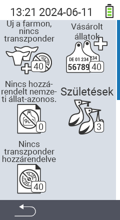

{}
Ha rákattint egy menüpontra, átirányítjuk az adott funkció leírásához.
{}

<map name="workmap">
  <area shape="rect" coords="3,40,116,160" alt="Új a farmon, nincs transzponder" title="Itt rendelhet transzpondert az új állatokhoz, amelyeknek még nincs transzponderük&#10;Egérkattintás: dokumentáció megnyitása" href="/hu/docs/new-on-farm/new-no-transponder/">
  <area shape="rect" coords="3,160,116,280" alt="Nincs nemzeti állatazonosító hozzárendelve" title="Itt megtekintheti az összes állatot, amelyhez még nem rendeltek nemzeti állatazonosítót, és hozzárendelhet egy nemzeti állatazonosítót&#10;Egérkattintás: dokumentáció megnyitása" href="/hu/docs/new-on-farm/no-national-animal-id-assigned/">
  <area shape="rect" coords="3,280,116,399" alt="Nincs transzponder hozzárendelve" title="Itt megtekintheti az összes állatot, amelyhez még nem rendeltek transzpondert, és hozzárendelhet egy transzpondert&#10;Egérkattintás: dokumentáció megnyitása" href="/hu/docs/new-on-farm/no-transponder-assigned/">

  <area shape="rect" coords="116,40,230,160" alt="Vásárolt állatok" title="Itt megtekintheti aktuális vásárlásait és exportálhatja az adatokat&#10;Egérkattintás: dokumentáció megnyitása" href="/hu/docs/new-on-farm/purchased-animals/">
  <area shape="rect" coords="116,160,230,280" alt="Születések" title="Itt megtekintheti a születéseket és létrehozhat egy export fájlt&#10;Egérkattintás: dokumentáció megnyitása" href="/hu/docs/new-on-farm/births/">
  <area shape="rect" coords="1,401,100,439" alt="Vissza" title="Ugrás egy szinttel vissza&#10;Egérkattintás: dokumentáció megnyitása" href="/hu/docs/menu/mainmenu/">
</map>
