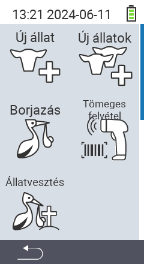

A főmenü  `Új` elemén keresztül egy almenübe jutunk, ahol 5 alpontelem választható:

<map name="workmap">
  <area shape="rect" coords="3,40,116,160" alt="Új állat" title="Hogyan regisztráljunk egy új állatot a VitalControl eszközzel&#10;Egérkattintás: dokumentáció megnyitása" href="/hu/docs/new/animal/">
  <area shape="rect" coords="3,160,116,280" alt="Ellés" title="Hogyan regisztráljunk egy új ellést a VitalControl eszközzel&#10;Egérkattintás: dokumentáció megnyitása" href="/hu/docs/new/calving/">
  <area shape="rect" coords="3,280,116,399" alt="Állatveszteség" title="Hogyan regisztráljuk egy állat elvesztését a VitalControl eszközzel&#10;Egérkattintás: dokumentáció megnyitása" href="/hu/docs/new/animal-loss/">

  <area shape="rect" coords="116,40,230,160" alt="Új állatok" title="Hogyan hozzunk létre több új állatot a VitalControl eszközön egyetlen művelettel&#10;Egérkattintás: dokumentáció megnyitása" href="/hu/docs/new/animals/">
  <area shape="rect" coords="116,160,230,280" alt="Tömeges rögzítés" title="Használja a vonalkódolvasót különféle állatok rögzítéséhez&#10;Egérkattintás: dokumentáció megnyitása" href="/hu/docs/new/bulk-recording/">

  <area shape="rect" coords="1,401,100,439" alt="Vissza" title="Ugrás egy szinttel vissza&#10;Egérkattintás: dokumentáció megnyitása" href="/hu/docs/menu/mainmenu/">
</map>

{}
Minden almenü saját ikonnal rendelkezik. Vigye az egérmutatót a fenti grafikában található ikon fölé, és hagyja ott egy pillanatra. Megjelenik egy tooltip, amely információkat mutat a kiválasztott almenüpontról. Ha rákattint egy ikonra, a kiválasztott almenüpont leírásához lesz irányítva.
{}
