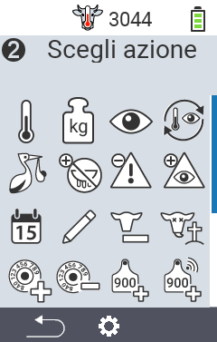
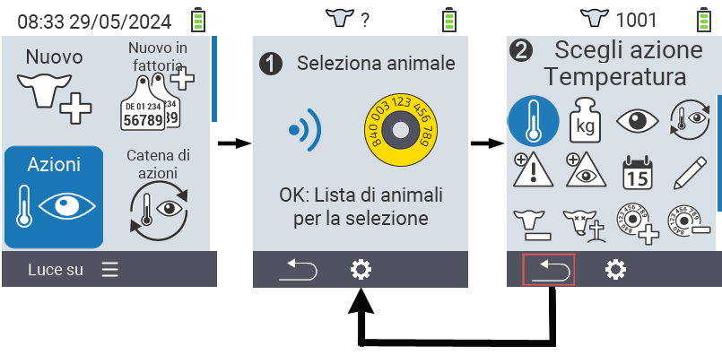

## Azioni disponibili

A seconda del tipo di animale, puoi eseguire fino a 16 diverse azioni per un animale.

<map name="workmap">
  <area shape="rect" coords="3,100,60,165" alt="Temperatura" title="Misura la febbre nei tuoi animali&#10;Clic del mouse: apri la documentazione" href="/it/docs/actions/measure-temperature/">
  <area shape="rect" coords="60,100,118,165" alt="Pesatura" title="Registra il peso dei tuoi animali&#10;Clic del mouse: apri la documentazione" href="/it/docs/actions/record-weight/">
  <area shape="rect" coords="118,100,174,165" alt="Valutazione" title="Valuta i tuoi animali&#10;Clic del mouse: apri la documentazione" href="/it/docs/actions/rating/">
  <area shape="rect" coords="174,100,230,165" alt="Catena di azioni" title="Applicare e impostare la catena di azioni&#10;Clic del mouse: apri la documentazione" href="/it/docs/chain-of-actions/">
   <area shape="rect" coords="3,165,60,225" alt="Parto" title="Registra un parto&#10;Clic del mouse: apri la documentazione" href="/it/docs/actions/calving/">
   <area shape="rect" coords="60,165,120,225" alt="Asciutta" title=" Asciuga una mucca o aggiungila alla lista delle mucche fresche&#10;Clic del mouse: apri la documentazione" href="/it/docs/actions/dry-off/">
   <area shape="rect" coords="120,165,175,225" alt="Allarme" title="Aggiungi e rimuovi animali dalla lista degli allarmi&#10;Clic del mouse: apri la documentazione" href="/it/docs/actions/alarm/">
   <area shape="rect" coords="175,165,230,225" alt="Sotto osservazione" title="Metti gli animali nella lista di osservazione o rimuovili&#10;Clic del mouse: apri la documentazione" href="/it/docs/actions/on-watch/">
   <area shape="rect" coords="3,225,60,280" alt="Storia dell'animale" title="Visualizza la storia di un animale&#10;Clic del mouse: apri la documentazione" href="/it/docs/actions/animal-history/">
   <area shape="rect" coords="60,225,120,280" alt="Modifica" title="Modifica i dati dell'animale selezionato&#10;Clic del mouse: apri la documentazione" href="/it/docs/actions/edit/">
   <area shape="rect" coords="120,225,175,280" alt="Deregistra" title="Deregistra un animale&#10;Clic del mouse: apri la documentazione" href="/it/docs/actions/unregister/">
   <area shape="rect" coords="175,225,230,280" alt="Perdita dell'animale" title="Registra una perdita di un animale&#10;Clic del mouse: apri la documentazione" href="/it/docs/actions/animal-loss/">
   <area shape="rect" coords="3,280,60,337" alt="Collega transponder" title="Assegna un transponder a un animale&#10;Clic del mouse: apri la documentazione" href="/it/docs/actions/link-transponder/">
   <area shape="rect" coords="55,280,120,337" alt="Scollega transponder" title="Rimuovi il collegamento del transponder a un animale&#10;Clic del mouse: apri la documentazione" href="/it/docs/actions/unlink-transponder/">
   <area shape="rect" coords="120,280,175,337" alt="Collega ID animale manualmente" title="Assegna un ID animale nazionale a un animale che non ha un ID animale nazionale&#10;Clic del mouse: apri la documentazione" href="/it/docs/actions/link-animal-id/#link-animal-id">
   <area shape="rect" coords="175,280,230,337" alt="Collega ID animale con scansione" title="Assegna un ID animale nazionale a un animale che non ha un ID animale nazionale&#10;Clic del mouse: apri la documentazione" href="/it/docs/actions/link-animal-id/#link-animal-id-with-electronic-ear-tag-scan">

   <area shape="rect" coords="100,340,140,375" alt="Impostazioni" title="Richiama le impostazioni&#10;Clic del mouse: alla documentazione" href="/it/docs/actions/settings/">
</map>

{}
Ogni azione è identificata da un simbolo. Sposta il puntatore del mouse su un simbolo nella grafica sottostante e lascialo riposare per un momento. Apparirà un tooltip che presenta informazioni sull'azione rispettiva. Se fai clic su uno dei simboli, verrai indirizzato a una descrizione dell'azione rispettiva.
{}

## Procedura generale

All'interno del menu  `` puoi selezionare il prossimo animale in qualsiasi momento senza dover lasciare la voce di menu Azioni. Per selezionare il prossimo animale, procedi come segue:

1. Seleziona la voce di menu  `` nella schermata principale del tuo dispositivo VitalControl e premi il pulsante ``.

2. Scansiona un animale utilizzando il transponder o seleziona un animale dall'elenco. Conferma premendo `` e seleziona un animale utilizzando i pulsanti freccia △ ▽. Conferma con ``.

3. Si apre un sottomenu in cui troverai icone per numerose azioni sugli animali. Usa i pulsanti freccia per selezionare l'azione desiderata e avvia l'azione premendo il pulsante ``. A seconda dell'azione selezionata, appariranno una o più schermate o una finestra pop-up.

4. Se lo desideri, puoi ora selezionare ed eseguire un'altra azione per l'animale corrente.

5. Dopo aver eseguito l'azione o le azioni desiderate per l'animale, torna al passaggio 2 'Selezione animale'. Per fare ciò, premi il pulsante sinistro `F1` sotto il simbolo `` nell'angolo in basso a sinistra del footer.

6. La finestra del passaggio due si aprirà nuovamente automaticamente e potrai selezionare il prossimo animale o tornare al menu principale premendo il pulsante `F1` sotto il simbolo ``.



{}

{}
{}

{}


