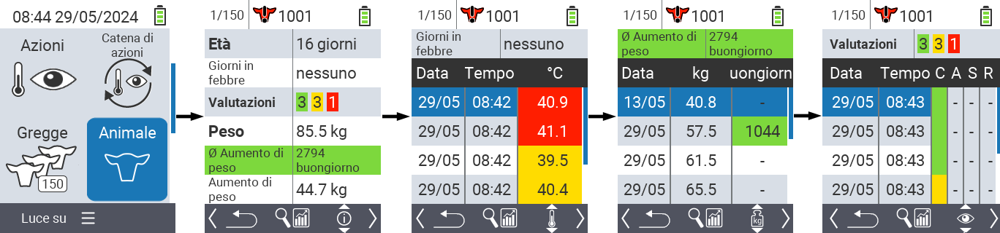
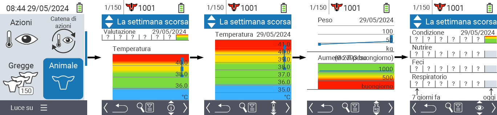
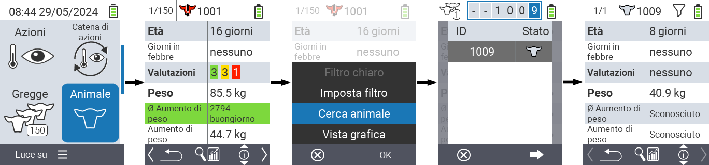
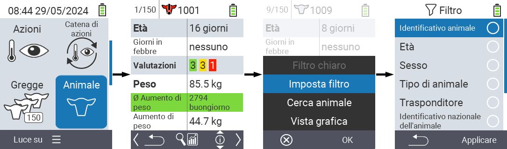

## Animale {#animal}

La funzione animale individuale ti consente di visualizzare informazioni importanti su peso, temperatura e valutazione per ciascun animale. Hai sempre la possibilità di visualizzare le informazioni come grafico o come elenco. Per utilizzare la funzione animale singolo, procedi come segue:

1. Nella schermata principale del tuo dispositivo VitalControl, seleziona l'elemento del menu  `` e premi il pulsante ``.

2. Si apre una panoramica delle informazioni più importanti sull'animale. Il bordo superiore dello schermo ti mostra quale animale stai visualizzando. Usa il tasto `F3` per scegliere tra informazioni sull'animale , temperatura , peso  e valutazione .

{}
All'interno di ciascuna visualizzazione delle informazioni hai la possibilità di [cercare un animale](#search-animal), impostare un [filtro](#set-filter) e passare a una [visualizzazione grafica](#set-graphical-view).
Puoi anche passare tra i singoli animali in qualsiasi momento utilizzando i tasti freccia ◁ ▷.
{}

### Imposta visualizzazione grafica {#set-graphical-view}

1. Premi il pulsante centrale superiore `On/Off`  per aprire un menu a comparsa. In questo menu, puoi scegliere tra le funzioni ``, `` o ``.

2. Seleziona `` con i tasti freccia △ ▽ e conferma con ``.

### Cerca animale {#search-animal}

1. Premi il pulsante centrale superiore `On/Off`  per aprire un menu a comparsa. In questo menu, puoi scegliere tra le funzioni ``, `` o ``.

2. Seleziona `` con i tasti freccia △ ▽ e conferma con ``.

3. Usa i tasti freccia △ ▽ ◁ ▷ per selezionare il numero dell'animale desiderato e conferma con ``.

### Imposta filtro {#set-filter}

1. Premi il pulsante centrale superiore `On/Off`  per aprire un menu a comparsa. In questo menu, puoi scegliere tra le funzioni ``, `` o ``.

2. Seleziona `` con i tasti freccia △ ▽ e conferma con ``.
Puoi ottenere istruzioni su come utilizzare il filtro [qui]().

