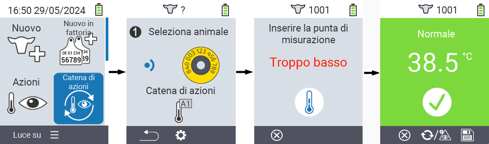
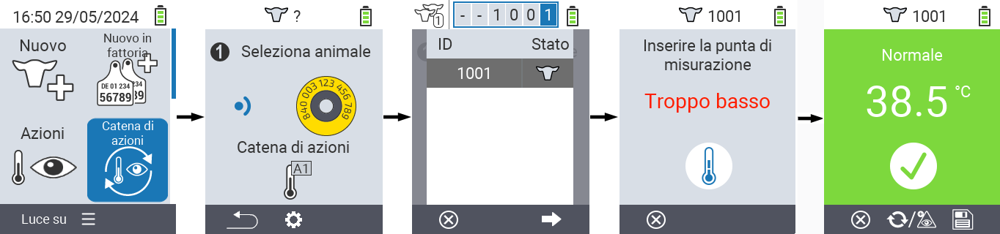
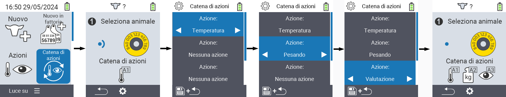

## Catena di azioni {#chain-of-actions}

La catena di azioni ti permette di eseguire automaticamente diverse azioni per un animale una dopo l'altra. Ad esempio, puoi selezionare le azioni `` e ``. Se poi esegui la catena di azioni, puoi prima misurare la temperatura del tuo animale e registrare immediatamente la valutazione subito dopo.

### Utilizzare la catena di azioni {#use-chain-of-actions}

1. Nella schermata principale del tuo dispositivo VitalControl, seleziona la voce di menu &nbsp;&nbsp; `` e premi il pulsante ``.

2. Scansiona un animale utilizzando il transponder oppure conferma con `` e usa i tasti freccia △ ▽ ◁ ▷ per inserire l'ID dell'animale desiderato.

3. La catena di azioni viene ora eseguita. Non appena tutte le azioni nella catena di azioni sono state eseguite, è possibile selezionare direttamente il prossimo animale.



{}

{}
{}

{}


### Configurare la catena di azioni {#set-chain-of-actions}

1. Nella schermata principale del tuo dispositivo VitalControl, seleziona la voce di menu &nbsp;&nbsp; `` e premi il pulsante ``.

2. Usa il pulsante `F2` &nbsp;&nbsp; (``).

3. Viene visualizzata una schermata sovrapposta. Usa i tasti freccia △ ▽ per scegliere tra le azioni elencate 1 - 4 (puoi eseguire fino a quattro azioni di seguito). Usa i tasti freccia ◁ ▷ per selezionare l'azione desiderata per ciascuna azione. Salva le impostazioni con il tasto `F1` &nbsp;&nbsp;.

4. Se desideri resettare l'intera catena di azioni, seleziona l'opzione `` nel sottomenu utilizzando i tasti freccia △ ▽ e conferma con ``.

    

{}
All'interno delle singole azioni hai le stesse opzioni di impostazione descritte nel capitolo [Azioni](../actions) per ciascuna azione individuale.
{}

{}
I simboli nella schermata iniziale della catena di azioni mostrano quali azioni hai impostato e in quale ordine.
{}
