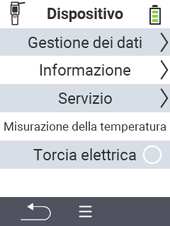

{}
Se fai clic su un elemento del menu, verrai reindirizzato a una descrizione della rispettiva funzione.
{}

<map name="workmap">
  <area shape="rect" coords="2,40,238,80" alt="Gestione dei dati" title="Esegui backup dei dati, esporta i tuoi dati e ripristina il dispositivo&#10;Clic del mouse: apri la documentazione" href="/it/docs/device/data-management/">
  <area shape="rect" coords="2,80,238,120" alt="Informazioni" title="Visualizza importanti informazioni sul software e sull'hardware&#10;Clic del mouse: apri la documentazione" href="/it/docs/device/info/">
  <area shape="rect" coords="2,120,238,160" alt="Servizio" title="Controlla i driver del tuo dispositivo, aggiorna il firmware ed esegui un test di portata&#10;Clic del mouse: apri la documentazione" href="/it/docs/device/service/">
  <area shape="rect" coords="2,160,238,200" alt="Misurazione della temperatura" title="Testa la misurazione della temperatura del tuo dispositivo&#10;Clic del mouse: apri la documentazione" href="/it/docs/device/temperature-measurement/">
  <area shape="rect" coords="2,200,238,240" alt="Torcia" title="Accendi o spegni la luce sul tuo dispositivo VitalControl&#10;Clic del mouse: apri la documentazione" href="/it/docs/device/flashlight/">

  <area shape="rect" coords="2,282,97,318" alt="Indietro" title="Torna indietro di un livello" href="/it/docs/menu/mainmenu/">
</map>
