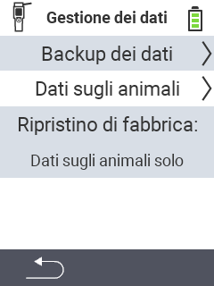

{}
Se fai clic su un elemento del menu, verrai reindirizzato a una descrizione della rispettiva funzione.
{}

<map name="workmap">
  <area shape="rect" coords="2,40,238,80" alt="Backup dei dati" title="Le istruzioni per creare un backup possono essere trovate qui&#10;Clic del mouse: apri la documentazione" href="/it/docs/device/data-management/data-backup/">

  <area shape="rect" coords="2,80,238,120" alt="Dati degli animali" title="Le istruzioni per ripristinare un backup possono essere trovate qui&#10;Clic del mouse: apri la documentazione" href="/it/docs/device/data-management/animal-data/">

  <area shape="rect" coords="2,120,238,200" alt="Ripristino delle impostazioni di fabbrica" title="Tutte le informazioni e le istruzioni per ripristinare il dispositivo e i dati degli animali possono essere trovate qui&#10;Clic del mouse: apri la documentazione" href="/it/docs/reset/">

  <area shape="rect" coords="2,282,120,319" alt="Indietro" title="Tutte le informazioni e le istruzioni per esportare i dati degli animali possono essere trovate qui&#10;Clic del mouse: apri la documentazione" href="/it/docs/device/">
</map>
