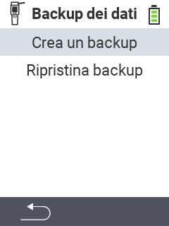

<map name="workmap">
  <area shape="rect" coords="2,40,238,80" alt="Crea backup" title="Le istruzioni per creare un backup possono essere trovate qui&#10;Clic del mouse: apri documentazione" href="/it/docs/backup/backup/">

  <area shape="rect" coords="2,80,238,120" alt="Ripristina backup" title="Le istruzioni per ripristinare un backup possono essere trovate qui&#10;Clic del mouse: apri documentazione" href="/it/docs/backup/restore/">

  <area shape="rect" coords="2,282,120,319" alt="Indietro" title="Torna indietro di un livello&#10;Clic del mouse: apri documentazione" href="/it/docs/device/data-management/">
</map>
