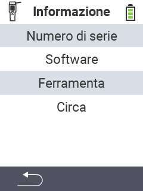

{}
Se clicchi su un elemento del menu, verrai reindirizzato a una descrizione della rispettiva funzione.
{}

<map name="workmap">
  <area shape="rect" coords="2,40,238,80" alt="Numero di serie" title="Per recuperare il numero di serie del tuo dispositivo clicca qui&#10;Mausklick: zur Dokumentation" href="/it/docs/device/info/serial-number/">
  <area shape="rect" coords="2,80,238,120" alt="Software" title="Le istruzioni per visualizzare la versione del tuo software si trovano qui&#10;Mausklick: zur Dokumentation" href="/it/docs/firmware/versions/">
  <area shape="rect" coords="2,120,238,160" alt="Hardware" title="Per accedere alle informazioni sull'hardware del tuo dispositivo clicca qui&#10;Mausklick: zur Dokumentation" href="/it/docs/device/info/hardware/">
  <area shape="rect" coords="2,160,238,200" alt="Informazioni" title="Richiama informazioni sul fornitore&#10;Mausklick: zur Dokumentation" href="/it/docs/device/info/about/">

  <area shape="rect" coords="2,282,120,319" alt="Indietro" title="Torna al livello precedente&#10;Mouse click: apri documentazione" href="/it/docs/device/">
</map>
