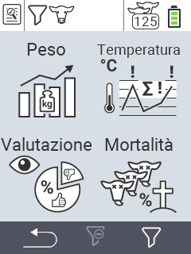

{}
Se fai clic su un elemento del menu, verrai reindirizzato a una descrizione della rispettiva funzione.
{}

<map name="workmap">
  <area shape="rect" coords="3,40,116,160" alt="Peso" title="Valuta i tuoi dati memorizzati nella sezione Peso&#10;Clic del mouse: apri la documentazione" href="/it/docs/evaluation/weight/">
  <area shape="rect" coords="3,160,116,279" alt="Valutazione" title="Valuta i tuoi dati memorizzati nella sezione valutazione&#10;Clic del mouse: apri la documentazione" href="/it/docs/evaluation/rating/">

  <area shape="rect" coords="116,40,238,160" alt="Temperatura" title="Valuta i tuoi dati memorizzati nella sezione Temperatura&#10;Clic del mouse: apri la documentazione" href="/it/docs/evaluation/temperature/">
  <area shape="rect" coords="116,160,238,279" alt="Mortalità" title="Valuta i tuoi dati memorizzati nella sezione mortalità&#10;Clic del mouse: apri la documentazione" href="/it/docs/evaluation/mortality/">

  <area shape="rect" coords="150,282,238,319" alt="Filtro" title="Imposta un filtro&#10;Clic del mouse: alla documentazione" href="/it/docs/filter">
  <area shape="rect" coords="2,282,95,319" alt="Indietro" title="Torna indietro di un livello&#10;Clic del mouse: alla documentazione" href="/it/docs/menu/mainmenu/">
</map>
