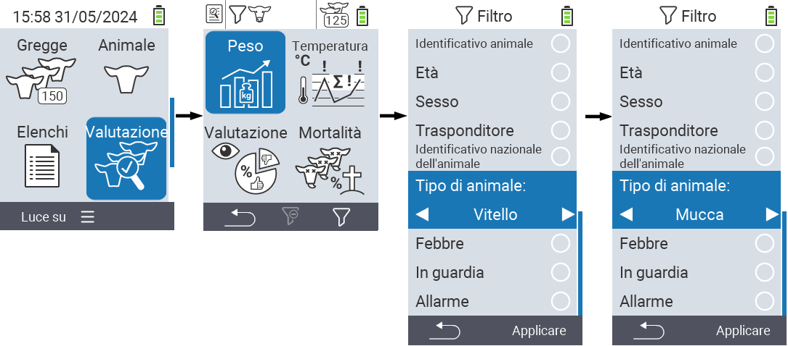
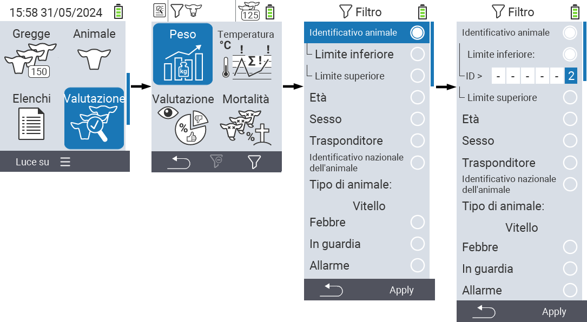
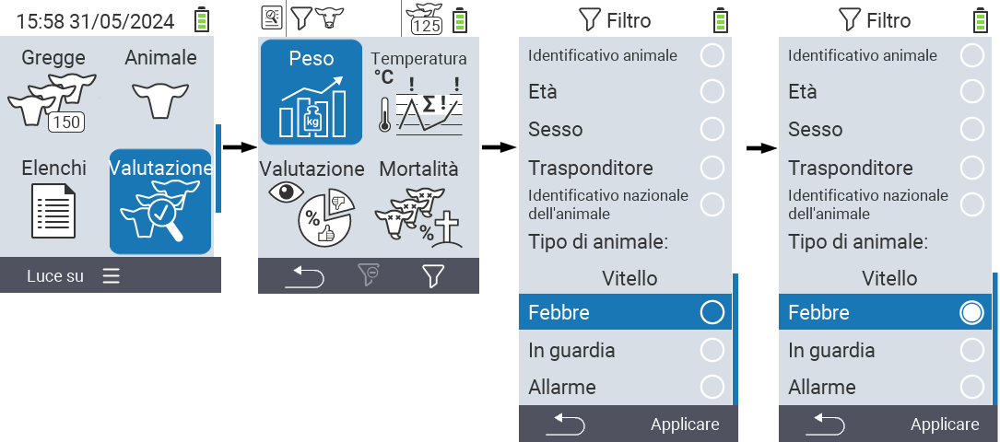

## Applicare filtri

{}
Il filtro ti aiuta a effettuare una selezione utilizzando criteri di filtro all'interno delle voci di menu `Mandria`, `Liste` e `Valutazione` del dispositivo VitalControl. Non appena applichi un filtro, i simboli per i vari criteri di filtro appaiono nella parte superiore dello schermo. Questi simboli vengono utilizzati per aiutarti a capire se e quali criteri di filtro sono attivati. Ad esempio, se imposti il filtro `Sesso` su maschio, il dispositivo utilizzerà solo animali maschi. Ad esempio, se attivi anche il filtro `In osservazione`, il dispositivo utilizza solo animali maschi che sono nella lista di osservazione.
{}

Per creare un filtro nelle valutazioni, procedi come segue:

1. Nel sottomenu appartenente alla voce di menu principale  `Valutazione` premi il tasto `F3`  una volta. All'interno del sottomenu appartenente alle voci di menu principali  `Liste` e  `Mandria`, devi premere il tasto due volte.

2. Si apre un sottomenu in cui puoi impostare tutte le opzioni di filtro. Puoi filtrare per `ID Animale`, `Età`, `Sesso`, `Transponder`, `ID Nazionale Animale`, `Febbre`, `In osservazione`, `Tipo di animale` e `Allarme`.

3. Per i filtri `Tipo di animale`, `Sesso`, `Transponder` e `ID Nazionale Animale` naviga nell'area corrispondente e conferma con `OK`. Usa i tasti freccia ◁ ▷ per specificare l'impostazione desiderata. Usa il tasto `F3` `Applica` per mettere in atto l'impostazione selezionata. Per scartare le modifiche al filtro, premi il tasto `F1` &nbsp;&nbsp;.

   

4. Per i filtri `ID Animale` e `Età` seleziona il criterio corrispondente e conferma con `OK`. Ora ti verrà mostrato un limite inferiore e superiore. Naviga fino al limite desiderato utilizzando i tasti freccia △ ▽ e conferma premendo `OK` due volte. Ora puoi impostare il numero desiderato utilizzando i tasti freccia ◁ ▷ e i tasti freccia △ ▽. Una volta che tutte le impostazioni sono corrette, premi di nuovo `OK` per uscire dalla modalità di impostazione e applica il/i filtro/i selezionato/i con il tasto `F3` `Applica`. Utilizzando il tasto `F1` &nbsp;&nbsp;, puoi annullare le tue modifiche se lo desideri.

   

5. Per i filtri `Febbre`, `In osservazione` e `Allarme` c'è la possibilità di disabilitare o abilitare la loro applicazione. Per fare ciò, seleziona il filtro corrispondente e conferma con `OK`. Il filtro è ora attivo. Conferma di nuovo con `OK` per disattivare il filtro.

   

6. Una volta impostati tutti i filtri, utilizza il tasto `F3` `Applica` per mettere in atto i filtri definiti o premi il tasto `F1`  per annullare le modifiche ai filtri.
