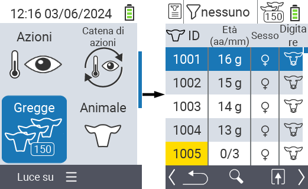
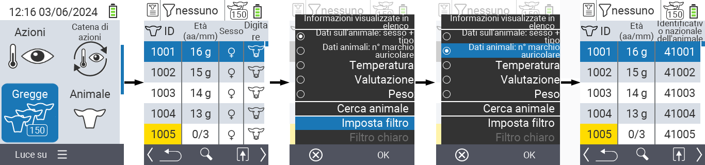
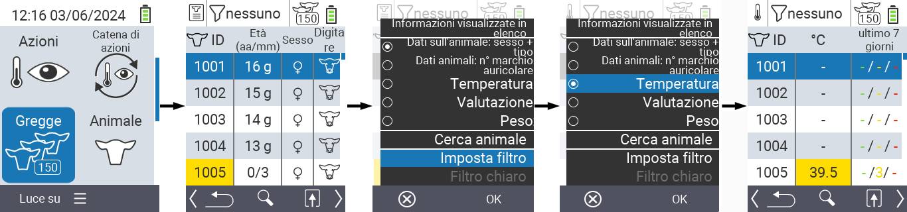
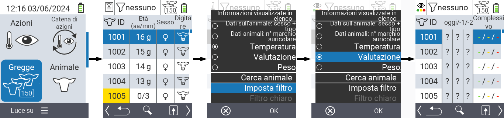
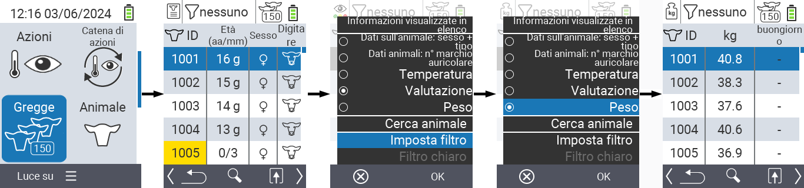
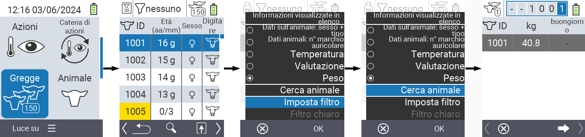
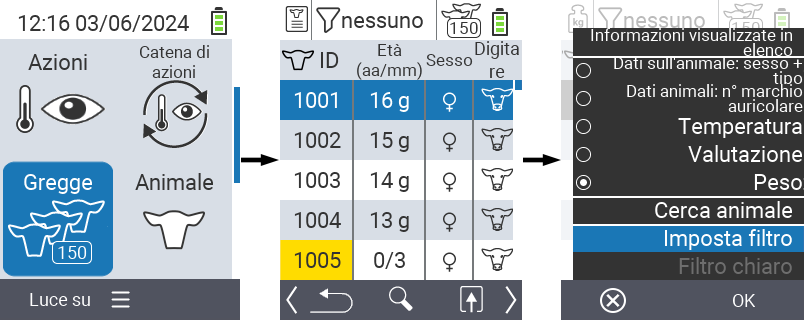
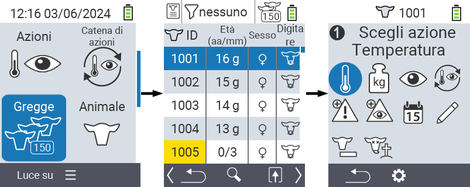

## Mandria {#herd}

All'interno della voce di menu Mandria, puoi visualizzare l'intera mandria, cercare animali individuali e visualizzare informazioni importanti. Hai le seguenti possibilità:

- Visualizza [dati degli animali](#view-animal-data)
- Visualizza [dati sulla temperatura](#display-temperature)
- Visualizza [dati di valutazione](#view-rating)
- Visualizza [dati sul peso](#display-weight)
- [Cerca animale](#search-animal)
- Imposta [filtro](#set-filter)
- [Azioni](#call-action-menu)

### Passi preparatori {#preparatory-steps}

1. Nella schermata principale del tuo dispositivo VitalControl, seleziona la voce di menu  `Mandria` e premi il pulsante `OK`.

2. Si apre la panoramica della tua mandria.

    

### Visualizza dati degli animali {#view-animal-data}

1. Completa i passi preparatori.

2. Usa il tasto `F3` &nbsp;&nbsp; per richiamare un menu popup che elenca le categorie di informazioni che possono essere visualizzate per l'elenco della mandria. Usa i tasti freccia △ ▽ per evidenziare la linea `Dati degli animali: sesso + tipo` o `Dati degli animali: N0 marca auricolare` e seleziona questa categoria premendo il pulsante centrale `OK` o il tasto `F3` `OK`. Le due opzioni di selezione differiscono nella visualizzazione della barra delle informazioni.

3. I dati degli animali verranno ora visualizzati come contenuto dell'elenco della mandria.

4. In alternativa, puoi usare i tasti freccia ◁ ▷ per passare tra le diverse opzioni di visualizzazione.

    

{}
Per impostazione predefinita, i dati degli animali vengono visualizzati per primi. Solo quando hai visualizzato il peso, ad esempio, devi impostare nuovamente la visualizzazione dei dati degli animali.
{}

### Visualizza temperatura {#display-temperature}

1. Completa i passi preparatori.

2. Usa il tasto `F3` &nbsp;&nbsp; per richiamare un menu popup che elenca le categorie di informazioni che possono essere visualizzate per l'elenco del gregge. Usa i tasti freccia △ ▽ per evidenziare la linea `Temperatura` e seleziona questa categoria premendo il pulsante centrale `OK` o il tasto `F3` `OK`.

3. I dati della temperatura verranno ora visualizzati come contenuto dell'elenco del gregge.

4. In alternativa, puoi usare i tasti freccia ◁ ▷ per passare tra le diverse opzioni di visualizzazione.

    

### Visualizza valutazione {#view-rating}

1. Completa i passaggi preparatori.

2. Usa il tasto `F3` &nbsp;&nbsp; per richiamare un menu popup che elenca le categorie di informazioni che possono essere visualizzate per l'elenco del gregge. Usa i tasti freccia △ ▽ per evidenziare la linea `Valutazione` e seleziona questa categoria premendo il pulsante centrale `OK` o il tasto `F3` `OK`.

3. I dati della valutazione verranno ora visualizzati come contenuto dell'elenco del gregge.

4. In alternativa, puoi usare i tasti freccia ◁ ▷ per passare tra le diverse opzioni di visualizzazione.

    

### Visualizza peso {#display-weight}

1. Completa i passaggi preparatori.

2. Usa il tasto `F3` &nbsp;&nbsp; per richiamare un menu popup che elenca le categorie di informazioni che possono essere visualizzate per l'elenco del gregge. Usa i tasti freccia △ ▽ per evidenziare la linea `Peso` e seleziona questa categoria premendo il pulsante centrale `OK` o il tasto `F3` `OK`.

3. I dati del peso verranno ora visualizzati come contenuto dell'elenco del gregge.

4. In alternativa, puoi usare i tasti freccia ◁ ▷ per passare tra le diverse opzioni di visualizzazione.

    

### Cerca animale {#search-animal}

1. Completa i passaggi preparatori.

2. Usa il tasto `F3` &nbsp;&nbsp; per richiamare un menu popup che elenca varie opzioni. Usa i tasti freccia △ ▽ per evidenziare la funzione `Cerca animale` e richiamare la funzione di ricerca premendo il tasto centrale `OK` o il tasto `F3` `OK`. In alternativa, puoi usare il pulsante `On/Off`  immediatamente dopo il primo passaggio.

3. Usa i tasti freccia △ ▽ ◁ ▷ per inserire il numero dell'animale desiderato e conferma con `OK`.

    

### Imposta filtro {#set-filter}

1. Completa i passaggi preparatori.

2. Usa il tasto `F3` &nbsp;&nbsp; per richiamare un menu popup che elenca varie opzioni. Usa i tasti freccia △ ▽ per evidenziare la funzione `Imposta filtro` e invoca la funzione filtro premendo il tasto centrale `OK` o il tasto `F3` `OK`.

3. Come applicare il filtro può essere trovato [qui]().

    

### Chiama menu azioni {#call-action-menu}

Hai sempre la possibilità di richiamare il menu azioni per un animale.

1. Completa i passaggi preparatori.

2. Seleziona un animale dall'elenco con i tasti freccia △ ▽ e conferma con `OK`.

3. Il menu azioni è ora aperto. Come utilizzarlo può essere trovato [qui](../actions).

4. Torna all'elenco della mandria con il tasto `F3`.

    
