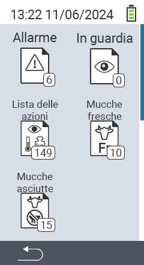

{}
Se clicchi su un elemento del menu, verrai reindirizzato a una descrizione della rispettiva funzione.
{}

<map name="workmap">
  <area shape="rect" coords="3,40,116,160" alt="Lista degli allarmi" title="Controlla la tua lista degli allarmi&#10;Clic del mouse: apri la documentazione" href="/it/docs/lists/alarm/">
  <area shape="rect" coords="3,160,116,280" alt="Lista delle azioni" title="Controlla la tua lista delle azioni&#10;Clic del mouse: apri la documentazione" href="/it/docs/lists/actions/">
  <area shape="rect" coords="3,280,116,399" alt="Lista delle vacche asciutte" title="Controlla la tua lista delle vacche asciutte&#10;Clic del mouse: apri la documentazione" href="/it/docs/lists/dry-cows/">

  <area shape="rect" coords="116,40,230,160" alt="Lista di sorveglianza" title="Controlla la tua lista di sorveglianza&#10;Clic del mouse: apri la documentazione" href="/it/docs/lists/on-watch/">
  <area shape="rect" coords="116,160,230,280" alt="Vacche fresche" title="Controlla la tua lista delle vacche fresche&#10;Clic del mouse: apri la documentazione" href="/it/docs/lists/fresh-cows/">

  <area shape="rect" coords="2,401,115,438" alt="Indietro" title="Torna indietro di un livello" href="/it/docs/menu/mainmenu/">
</map>
