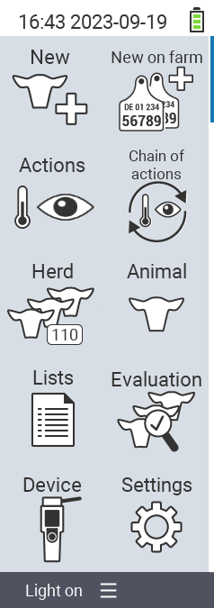

{}
Se clicchi su un elemento del menu, verrai reindirizzato a una descrizione della rispettiva funzione.
{}

<map name="workmap">
  <area shape="rect" coords="3,40,116,160" alt="Nuovo" title="Crea nuovi animali&#10;Clic del mouse: apri la documentazione" href="/it/docs/new/">
  <area shape="rect" coords="3,160,116,280" alt="Azioni" title="Azioni sugli animali&#10;Clic del mouse: apri la documentazione" href="/it/docs/actions/">
  <area shape="rect" coords="3,280,116,400" alt="Mandria" title="Menu mandria&#10;Clic del mouse: apri la documentazione" href="/it/docs/herd/">
  <area shape="rect" coords="3,400,116,520" alt="Liste" title="Liste di animali&#10;Clic del mouse: apri la documentazione" href="/it/docs/lists/">
  <area shape="rect" coords="3,520,116,634" alt="Dispositivo" title="Dispositivo&#10;Clic del mouse: apri la documentazione" href="/it/docs/device/">

  <area shape="rect" coords="116,40,230,160" alt="Nuovo in fattoria" title="Accesso degli animali&#10;Clic del mouse: apri la documentazione" href="/it/docs/new-on-farm/">
  <area shape="rect" coords="116,160,230,280" alt="Catena di azioni" title="Catena di azioni&#10;Clic del mouse: apri la documentazione" href="/it/docs/chain-of-actions/">
  <area shape="rect" coords="116,280,230,400" alt="Animale" title="Animale&#10;Clic del mouse: apri la documentazione" href="/it/docs/animal/">
  <area shape="rect" coords="116,400,230,520" alt="Valutazione" title="Valutazione&#10;Clic del mouse: apri la documentazione" href="/it/docs/evaluation/">
  <area shape="rect" coords="116,520,230,634" alt="Impostazioni" title="Impostazioni&#10;Clic del mouse: apri la documentazione" href="/it/docs/settings/">
</map>
