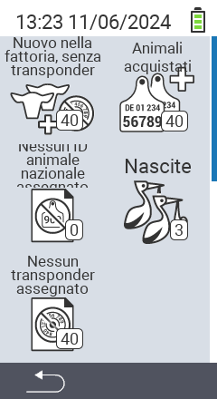

{}
Se clicchi su un elemento del menu, verrai reindirizzato a una descrizione della rispettiva funzione.
{}

<map name="workmap">
  <area shape="rect" coords="3,40,116,160" alt="Nuovo in fattoria, senza transponder" title="Qui assegni un transponder ai nuovi animali senza transponder&#10;Clic del mouse: apri la documentazione" href="/it/docs/new-on-farm/new-no-transponder/">
  <area shape="rect" coords="3,160,116,280" alt="Nessun ID animale nazionale assegnato" title="Qui puoi vedere tutti gli animali a cui non è stato ancora assegnato un ID animale nazionale e assegnare un ID animale nazionale&#10;Clic del mouse: apri la documentazione" href="/it/docs/new-on-farm/no-national-animal-id-assigned/">
  <area shape="rect" coords="3,280,116,399" alt="Nessun transponder assegnato" title="Qui puoi vedere tutti gli animali a cui non è stato ancora assegnato un transponder e assegnare loro un transponder&#10;Clic del mouse: apri la documentazione" href="/it/docs/new-on-farm/no-transponder-assigned/">

  <area shape="rect" coords="116,40,230,160" alt="Animali acquistati" title="Qui puoi vedere i tuoi acquisti attuali ed esportare i dati&#10;Clic del mouse: apri la documentazione" href="/it/docs/new-on-farm/purchased-animals/">
  <area shape="rect" coords="116,160,230,280" alt="Nascite" title="Qui puoi vedere le tue nascite e creare un file di esportazione&#10;Clic del mouse: apri la documentazione" href="/it/docs/new-on-farm/births/">
  <area shape="rect" coords="1,401,100,439" alt="Indietro" title="Torna indietro di un livello&#10;Clic del mouse: alla documentazione" href="/it/docs/menu/mainmenu/">
</map>
