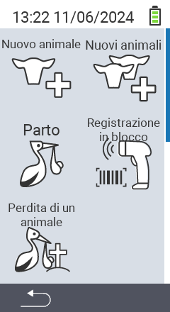

Tramite la voce di menu principale  `Nuovo` si accede a un sottomenu, dove vengono presentati 5 sottoelementi per la selezione:

<map name="workmap">
  <area shape="rect" coords="3,40,116,160" alt="Nuovo animale" title="Come registrare un nuovo animale utilizzando il dispositivo VitalControl&#10;Clic del mouse: apri la documentazione" href="/it/docs/new/animal/">
  <area shape="rect" coords="3,160,116,280" alt="Parto" title="Come registrare un nuovo parto utilizzando il dispositivo VitalControl&#10;Clic del mouse: apri la documentazione" href="/it/docs/new/calving/">
  <area shape="rect" coords="3,280,116,399" alt="Perdita di animale" title="Come registrare la perdita di un animale utilizzando il dispositivo VitalControl&#10;Clic del mouse: apri la documentazione" href="/it/docs/new/animal-loss/">

  <area shape="rect" coords="116,40,230,160" alt="Nuovi animali" title="Come creare più nuovi animali sul dispositivo VitalControl utilizzando una singola azione&#10;Clic del mouse: apri la documentazione" href="/it/docs/new/animals/">
  <area shape="rect" coords="116,160,230,280" alt="Registrazione di massa" title="Usa lo scanner di codici a barre per registrare una varietà di animali&#10;Clic del mouse: apri la documentazione" href="/it/docs/new/bulk-recording/">

  <area shape="rect" coords="1,401,100,439" alt="Indietro" title="Torna indietro di un livello&#10;Clic del mouse: alla documentazione" href="/it/docs/menu/mainmenu/">
</map>

{}
Ogni sottomenu ha la sua icona. Sposta il puntatore del mouse su un'icona nella grafica sopra e lascialo fermo per un momento. Apparirà un tooltip che mostra informazioni per il sottomenu selezionato. Se clicchi su una delle icone, verrai reindirizzato a una descrizione dell'elemento del sottomenu selezionato.
{}
